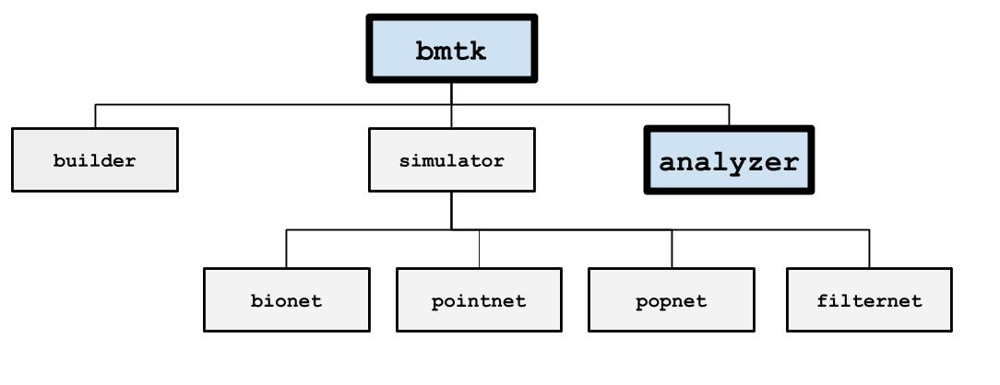
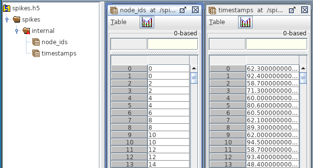
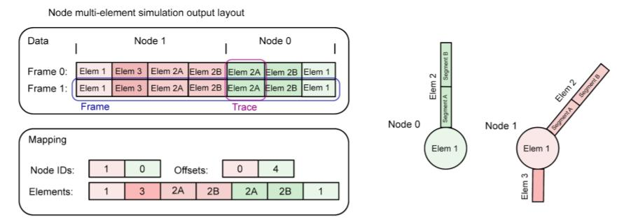

Analyzing the Results
=====================

After a simulation has been completed BMTK will automatically save the results to the output folder. It is possible to have
BMTK read and analyzes the results before the simulation has exited but is usually not required. The type of results saved
during the simulation is determined by the “reports” section of the `simulation config <./simulators.html#configuration-files>`_.
But most commonly it is a spikes-trains file, a cell-variable report, an extracellular potential recording, and in the
case of PopNet a report of the firing rate dynamics.

The output files follow the `SONATA Data format <https://github.com/AllenInstitute/sonata>`_, and tools like
`pySONATA <https://github.com/AllenInstitute/sonata/tree/master/src/pysonata>`_  or
`libSONATA <https://github.com/BlueBrain/libsonata>`_ can be used to read them. The following consists of a high-level
overview of these different formats and how you can use BMTK to find the results.

Spike-Trains
------------
Contains action potentials/spikes for all the nodes within a given population. In the HDF5 the spikes are stored under
/spikes/_<population_name>_/ and contains two data-sets:

* timestamps (size N): A list of all the spikes during the simulation
* node_ids (size N): A list of corresponding node_ids for each spike

The group may contain an attribute “sorting” with values none, by_id, and by_time to indicate if and how the spikes are
sorted (default none). There is also an optional attribute “units” for the timestamps, but defaults to milliseconds.

Reading
+++++++
You can use the :py:class:`SpikeTrains <bmtk.utils.reports.spike_trains.spike_trains_api.SpikeTrainsAPI>` class to load
a sonata spikes files (or csv or nwb) into memory:

.. code:: python

   from bmtk.utils.reports.spike_trains import SpikeTrains

   pop_name = ...
   spikes = SpikeTrains.load('output/spikes.h5', population='pop_name')
   assert(spikes.populations = [pop_name])
   print(spikes.n_spikes())
   print(spikes.node_ids())

If you know what node you want use the :py:meth:`get_times() <bmtk.utils.reports.spike_trains.spike_trains_api.SpikeTrainsAPI.get_times>`
method to return an array of all spikes for a single node

.. code:: python

   node0_times = spikes.get_times(node_id=0)
   print(node0_times)

Otherwise you can use the :py:meth:`to_dataframe() <bmtk.utils.reports.spike_trains.spike_trains_api.SpikeTrainsAPI.to_dataframe>`
or :py:meth:`spikes() <bmtk.utils.reports.spike_trains.spike_trains_api.SpikeTrainsAPI.spikes>`  method to get a list of
all node_ids plus timestamps

.. code:: python

   for ts, pop, node_id in spikes():
      assert(pop == pop_name)
      ...

.. code:: python

   print(spikes.to_dataframe())

Plotting
++++++++

Analysis
++++++++

Creating Spike Trains
+++++++++++++++++++++
Commonly it’s necessary to generate spike-trains to use as inputs for a simulation. One option is to use FilterNet to
generate inputs from external stimuli. You can also use the output of one simulation as the input to the next. But if
you need to generate your own spike files, in property SONATA format, BMTK provides two ways of readily doing so. One
is to use the :py:class:`SpikeTrains <bmtk.utils.reports.spike_trains.spike_trains_api.SpikeTrainsAPI>` class
:py:meth:`add_spikes() <bmtk.utils.reports.spike_trains.spike_trains_api.SpikeTrainsAPI.add_spikes>` or
:py:meth:`add_spike() <bmtk.utils.reports.spike_trains.spike_trains_api.SpikeTrainsAPI.add_spike>` method:

.. code:: python

   from bmtk.utils.reports.spike_trains import SpikeTrains

   spikes = SpikeTrains(population='my_inputs')
   spikes.add_spikes(node_ids=0, timestamps=[1.0, 2.0, 3.0, ...])
   spikes.add_spike(node_id=[1, 1, 2, 3],
                    timestamps=[0.5, 0.9, 1.0, 1.0])

Or use the :py:class:`PoissonSpikeGenerator <bmtk.utils.reports.spike_trains.spike_trains.PoissonSpikeGenerator>` class

.. code:: python

   from bmtk.utils.reports.spike_trains import PoissonSpikeGenerator

   psg = PoissonSpikeGenerator(population='thalamus')
   times = np.linspace(0.0, 3.0, 100000)
   frs = 10*np.sin(times) + 5.0
   psg.add(node_ids=range(10), firing_rate=frs, times=times)
   psg.add(node_ids=range(10, 20), firing_rate=15.0, times=(0.0, 3.0))
   psg.to_sonata('./inputs/thamlamus_inputs.h5')

Cell Variable Report
--------------------
Used to record the traces of intracellular and membrane variables throughout the simulation, like membrane
potential V. In the HDF5 cell reports are stored under /report/<population_name>/ with the most relevant datasets:

* data (size T_times x N_segments): All the recorded values, each row a different step in time and each column a
  different segment/cell
* mapping/time (size 3 or T_times): For the exact times of each recording. If the simulation time steps are uniform then
  the dataset contains 3 values: start_time, stop_time, and time_step (all in ms). Otherwise, the will be of size T_times
  for each recording time since the start of the simulation.
* node_ids: used to map each column to a specific cell

.. figure:: _static/images/cell_reports.png
   :scale: 60%

If the recording is done on point-neurons or one is only recording from the soma, there will be one column in “data” for
each node. If recording different sections from a multi-compartmental neuron then *mapping/index_pointers* should be
used:

Reading Cell Variables
++++++++++++++++++++++
The :py:class:`CompartmentReport <bmtk.utils.reports.compartment.core.CompartmentReaderABC>` class should be used to
pull data from a cell report.

.. code:: python

   bmtk.utils.reports.compartment import CompartmentReport

   pop_name = ...
   report = CompartmentReport('output/membrane_vm.h5',
   population=pop_name, mode='r')
   print(report.variable())
   print(report.tstart(), report.tstop(), report.dt())
   print(report.element_ids(node_id=0))
   print(report.element_pos(node_id=0))
   print(report.data(node_id=0))

.. code:: bash

   v
   0.0, 3.0, 0.01
   [0, 1, 2, 2, ...]
   [0.5, 0.5, 0.5, 05, ...]
   [[-50.010, -50.911, -50.995, -51.000, ...]
   [-49.933, -49.330, -50.011, -50.667, ...]
   ...]

Extracellular Potential
-----------------------

Rates
-----

