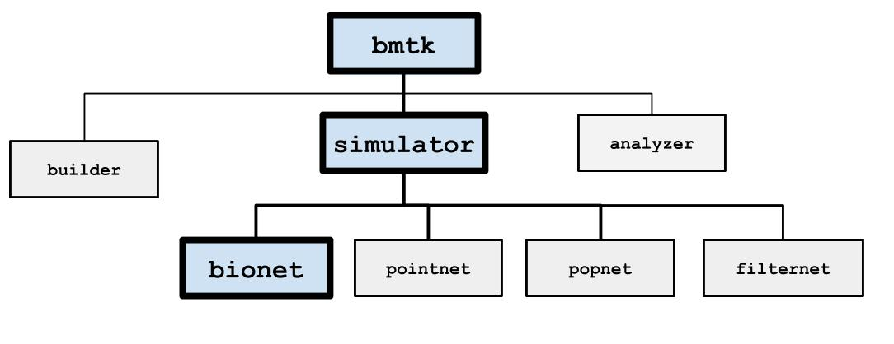
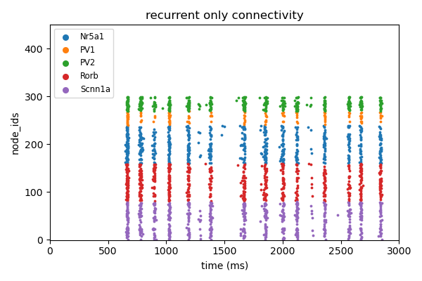
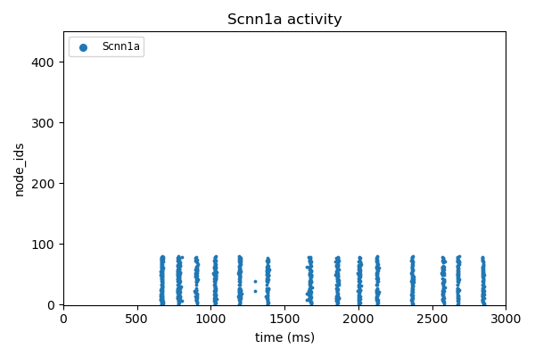

BioNet
======

BioNet is a high-level interface to `NEURON <http://neuron.yale.edu/neuron/>`_ that facilitates simulations of
large-scale networks of multicompartmental neurons. Some of its main features include:

* Automatically integrates MPI for parallel simulations without the need for extra coding.

* Supports models and morphologies from the Allen `Cell-Types Database <http://celltypes.brain-map.org/data>`_, as well
  as custom hoc and NeuroML2 cell and synapse models.

* Use spike-trains, synaptic connections, current clamps, or even extracellular stimulation to drive network firing.

* Can simulate extracellular field recordings.

Inputs
--------
Inputs can be specified in the “inputs” sections of the `simulation config <./simulators.html#configuration-files>`_,
following the rules specified in the `SONATA Data format <https://github.com/AllenInstitute/sonata>`_.

Spike-Trains
++++++++++++
The modeler may wish to have certain cells in the circuit generate a pre-arranged series of spikes to drive the network.
These cells must have ``model_type`` value ``virtual`` and are not actual cell objects (you can’t record from them). You
may use either a `SONATA spike file <https://github.com/AllenInstitute/sonata/blob/master/docs/SONATA_DEVELOPER_GUIDE.md#spike-file>`_,
an NWB file, or a space-separated CSV file with columns **node_id**, **population**, and **timestamps**. The following
shows some examples of how to generate `spike-train files using bmtk <./analyzer.html#creating-spike-trains>`_.

.. code:: json

    {
        "LGN_spikes": {
            "input_type": "spikes",
            "module": "sonata",
            "input_file": "./inputs/lgn_spikes.h5",
            "node_set": {"population": "lgn"}
        }
    }

* module:  either sonata, hdf5, CSV, or nwb: depending on the format of the spikes file

* `node_set <./simulators.html#node-sets>`_: used to filter which cells will receive the inputs

* input_file: path to file contain spike-trains for one or mode node

Current Clamp
+++++++++++++
May use one step current clamp-on multiple nodes, or have one node receive multiple current injections. Currently ;)
only support injections at the soma.

.. code:: json

    {
        "current_clamp_1": {
            "input_type": "current_clamp",
            "module": "IClamp",
            "node_set": "biophys_cells",
            "amp": 0.1500,
            "delay": 500.0,
            "duration": 500.0
        }
    }

* module:  Always IClamp
* `node_set <./simulators.html#node-sets>`_: used to filter which cells will receive the inputs
* amp: injection in pA
* delay: onset of current injection in ms
* duration: duration of current injection in ms

Voltage Clamp
+++++++++++++

Extracellular Stimulation
+++++++++++++++++++++++++
Allows for a set of external electrodes to provide a continuous stimulation in the neuropil. Requires a space-separated CSV file with one row for each electrode:

.. code:: text
    :name: xstim_electrode.csv

    ip pos_x pos_y pos_z rotation_x rotation_y rotation_z
    0 6.1803398874989481 0.0 19.021130325903069 0.0 0.0 0.0

And in the configuration file

.. code:: json

    {
        "extra_stim": {
            "input_type": "lfp",
            "module": "xstim",
            "node_set": "all",
            "positions_file": "./inputs/xstim_electrode.csv",
            "waveform": {
                "shape": "sin",
                "del": 1000.0,
                "amp": 0.100,
                "dur": 2000.0,
                "freq": 8.0
            }
        }
    }

* module:  Always xstim
* `node_set <./simulators.html#node-sets>`_: used to filter which cells will receive the inputs
* positions_file: onset of current injection in ms
* waveform: form on the input, requires arguments “shape”, “amp” (in pA), “del” (delay in ms) and “dur” (duration in ms). Shape may either be “dc” or “sin” (with optional arguments “freq”, “phase” and “offset”)

Spontaneous Firing
++++++++++++++++++

Outputs
-------
Spikes
++++++
By default, all non-virtual cells in the circuit will have all their spikes at the soma recorded. The “spike_threadhold”
the parameter in the “run” block of the simulation config is used to determine what counts as a spike for a conductance model
cell.

Membrane and Intracellular Variables
++++++++++++++++++++++++++++++++++++
Used to record the time trace of specific cell variables, usually the membrane potential (v). For multi-compartmental
cells the report can record from any segment that contains mechanics for the desired variable. See
`SONATA docs <https://github.com/AllenInstitute/sonata/blob/master/docs/SONATA_DEVELOPER_GUIDE.md#simulation-output---reports>`_
for more information about how multi-segment recordings are represented.

.. code:: json

    {
        "calcium_concentration": {
            "module": "membrane_report",
            "cells": {"population": "biophysical"},
            "variable_name": "cai",
            "sections": "soma",
            "file_name": "cai_traces.h5"
        },
        "membrane_potential": {
            "module": "membrane_report",
            "cells": {"node_ids": [0, 1, 2, 3, 4, 5]},
            "variable_name": "v",
            "sections": "all",
            "file_name": "cai_traces.h5"
        }
    }

* variable_name: name of the variable being recorded, will depend on the cell model
* cells: a `node_set <./simulators.html#node-sets>`_ to filter out what cells to record.
* sections: either “all”, “soma”, “basal” or “apical”
* file_name: name of the file where traces will be recorded, under the “output_dir”. If not specified the report title
  will be used, eg “calcium_concentration.h5” and “membrane_potential.h5”

.. warning::
    Disk space can be an issue when recording membrane variables. For large networks recording all segments or all cells, every 1-second simulation, can cause BMTK to try to write output files in the 100s of GB or even TB.

Extracellular Potential
+++++++++++++++++++++++
Will simulate recording from an extracellular electrode placed in the neuropil. See
`SONATA documentation <https://github.com/AllenInstitute/sonata/blob/master/docs/SONATA_DEVELOPER_GUIDE.md#extracellular-report>`_.
Requires a space-separated CSV file to specify the location of each recording channel:

.. code:: text
    :name: ./components/xelectrode/linear_probe.csv

    channel x_pos y_pos z_pos
    0 10.0 0 5.0
    1 10.0 -10 5.0
    2 10.0 -20 5.0
    3 10.0 -30 5.0
    4 10.0 -40 5.0

And in the config

.. code:: json

    {
        "ecp": {
            "cells": "all",
            "variable_name": "v",
            "module": "extracellular",
            "electrode_positions": "components/xelectrode/linear_probe.csv",
            "file_name": "ecp.h5",
            "contributions_dir": "ecp_contributions"
        }
    }

* cells: a `node_set <./simulators.html#node-sets>`_ to filter out what cells will contribute to the ECP.
* variable_name: name of contributing variable, v for membrane potential
* electrode_positions: name of electrode placement file
* contributions_dir: The output ECP file will contain the combined contributions from all cells, and not possible to
  determine the ECP of each cell. But if “contributions_dir” is specified it will also record and save each
  cells’ ECP.

Synaptic Variables
++++++++++++++++++
Similar to recording from membrane potential, by setting ``module`` parameter to ``netcon_report`` you can record the
variables from a synapse. The output is similar to a
`SONATA membrane report <https://github.com/AllenInstitute/sonata/blob/master/docs/SONATA_DEVELOPER_GUIDE.md#frame-oriented-node-element-recordings>`_,
but instead of each column being a segment of a neuron, each column represents a different synapse.

.. code:: json

    {
        "syn_report": {
            "cells": {"model_type": "biophysical"},
            "variable_name": "tau1",
            "module": "netcon_report",
            "sections": "soma",
            "syn_type": "Exp2Syn"
        }
    }

Advanced Options
----------------

Specifying Synapse locations
++++++++++++++++++++++++++++
In SONATA the location of each synapse is determined by the
`"afferent_section_id" and "afferent_section_pos" attributes <https://github.com/AllenInstitute/sonata/blob/master/docs/SONATA_DEVELOPER_GUIDE.md#edges---required-attributes>`_,
which requires modelers to know how NEURON parses the morphology of each cell. If these parameters are specified in the edges file
SONATA will use them to place a synapse on the target.

Alternatively, BMTK supports the optional parameters “distance_range" and “target_sections”, which are present in the edges
file, which will direct BMTK to randomly choose a target synapse location under the limitations. Here “target_setions” refers
to a neuronal area (somatic, axon, apical, basal), and “"istance_range” is the minimum and maximum arc-length distance
(in um) from the soma to place the synapse. For example to specify synapses be created either at the soma or nearby
basal dendrites:

.. code:: text
    :name: edge_type.csv

    edge_type_id distance_range target_sections ...
    100 "[0.0, 100.0]" "['somatic', 'basal']" ...

Using parameters “distance_range” and “target_sections” will speed up the instantiation by a bit. And has the benefit
that the modeler doesn’t need to know the full details of the target_morphology. It may cause results to vary, but in
our experience for large-networks usually don’t change the dynamics.

Replaying recurrent activity without inputs
+++++++++++++++++++++++++++++++++++++++++++
Most of the times when we are running a simulation of a recurrently-connected network, the network is being stimulated
by some non-recurrent source; like a voltage clamp, current clamp, extraceullar pulse, or being syanptically driven
by a pre-recorded spike-trains (eg, virtual cells). Thus the firing-times/voltage potentials of our network cells are
being driven by two primary sources; external inputs and synaptic/electrical activity from other cells in the network.
Being able to separate the contributions of the two type of drivers is often important for analysis of our network.

Being able to see how our network behaves without recurrent connections is usually trivial to implement using the SONATA
configuration file. For example, a network called "internal" might have both internal-to-internal recurrent connections
and external-to-internal connections as represented in the "networks" section of the config

.. code:: json

    {
      "networks": {
        "nodes": [
          {
          "nodes_file": "$NETWORK_DIR/internal_nodes.h5",
          "node_types_file": "$NETWORK_DIR/internal_node_types.csv"
          },
          {
            "nodes_file": "$NETWORK_DIR/external_nodes.h5",
            "node_types_file": "$NETWORK_DIR/external_node_types.csv"
          }
        ],
        "edges": [
          {
            "edges_file": "$NETWORK_DIR/internal_internal_edges.h5",
            "edge_types_file": "$NETWORK_DIR/internal_internal_edge_types.csv"
          },
          {
            "edges_file": "$NETWORK_DIR/external_internal_edges.h5",
            "edge_types_file": "$NETWORK_DIR/external_internal_edge_types.csv"
          }
        ]
      }
    }

To run the simulation without the recurrent internal-to-internal connections we just need to remove the relevant
SONATA network files:

.. code:: json

    {
      "networks": {
        "nodes": [
          {
            "nodes_file": "$NETWORK_DIR/internal_nodes.h5",
            "node_types_file": "$NETWORK_DIR/internal_node_types.csv"
          },
          {
            "nodes_file": "$NETWORK_DIR/external_nodes.h5",
            "node_types_file": "$NETWORK_DIR/external_node_types.csv"
          }
        ],
        "edges": [
          {
            "edges_file": "$NETWORK_DIR/external_internal_edges.h5",
            "edge_types_file": "$NETWORK_DIR/external_internal_edge_types.csv"
          }
        ]
      }
    }

Plotting the spikes raster we can see how the network behaves without recurrent connections (right) vs. the normal
fully connected simulation (left):

.. image:: _static/images/disconnected_normal_sims.png

But what if we want to rerun the full simulation but without the external inputs, how see how only the recurrent
activity affects the full simulation? To do so we must use a special **"replay"** input module. In the
"inputs" section of the config we add the following:

.. code:: json

    {
      "inputs": {
        "recurrent_replay": {
          "input_type": "replay_spikes",
          "module": "replay",
          "spikes_file": "$PREV_RESULTS_DIR/spikes.h5",
          "edges": {
            "edges_file": "$NETWORK_DIR/internal_internal_edges.h5",
            "edge_types_file": "$NETWORK_DIR/internal_internal_edge_types.csv"
          }
        }
      }
    }

Here we have
 * "*recurrent_replay*" is the name of this specific input and can be changed to whatever we like.
 * **input_type** and **module** are always set to *replay_spikes* and *replay*, respecitively, to direct bmtk as to the type of input/module being used.
 * **spikes_file** is the name of the recurrent spiking activity we want to replay when we rerun the simulation. In this case it is the locations of the output spikes results when we ran the fully connected simulation.
 * **edges** is the location of the edges and edge-types SONATA network files, in this case it is the files containing the recurrent internal-to-internal connections.

Then we update the "networks" section since we don't want to have any external-to-internal type connections:

.. code:: json

    {
      "networks": {
        "nodes": [
          {
            "nodes_file": "$NETWORK_DIR/internal_nodes.h5",
            "node_types_file": "$NETWORK_DIR/internal_node_types.csv"
          }
        ]
      }
    }

And we can run the simulation with the updated config and see what the network looks like when activity is only being
drived by recurrent activity

The module also has optional arguments **source_node_set** and **target_node_set** which allows us to rerun recurrent
connections, but only on edges where the source (pre-synaptic) and target (post-synaptic) cells meet certain criteria.
For example, we only want to run simulation on edges where the target cells are "biophysically-detailed Scnn1a" cells
and the source cells are either "Scnn1a", "Rorb", or "Nr5a1" cell-types.

.. code:: json

    {
      "inputs": {
        "recurrent_replay": {
          "input_type": "replay_spikes",
          "module": "replay",
          "spikes_file": "$PREV_RESULTS_DIR/spikes.h5",
          "source_node_set": {
            "population": "internal",
            "model_name": ["Scnn1a", "Rorb", "Nr5a1"]
          },
          "target_node_set": {
            "population": "internal",
            "model_name": "Scnn1a",
            "model_type": "biophysical"
          },
          "edges": {
            "edges_file": "$NETWORK_DIR/internal_internal_edges.h5",
            "edge_types_file": "$NETWORK_DIR/internal_internal_edge_types.csv"
          }
        }
      }
    }

You can combine "replay" inputs with virtual inputs, current and voltage clamps. And you can have multiple
"replay" inputs in the same simulation by adding multiple subsections in the "inputs" sections of the config:

.. code:: json

    {
      "inputs": {
        "replay_1": {
          "input_type": "replay_spikes",
          "module": "replay",
          ...
        },
        "replay_1": {
          "input_type": "replay_spikes",
          "module": "replay",
          ...
        },
      }
    }

See the `examples/bio_450cells_replay/ <https://github.com/AllenInstitute/bmtk/tree/develop/examples/bio_450cells_replay>`_
folder for examples of running replayed simulations.

