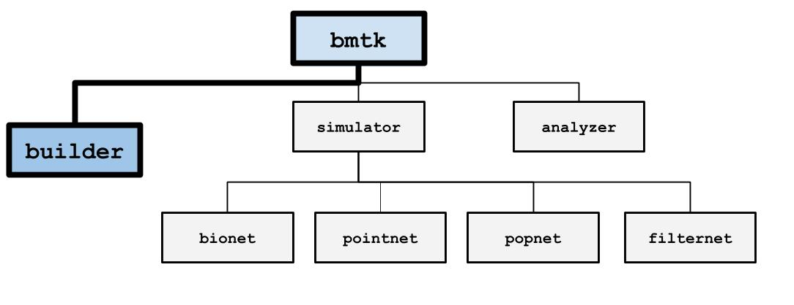
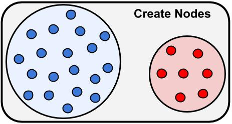
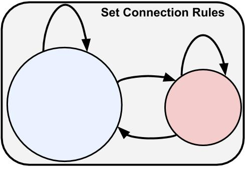
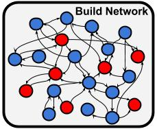
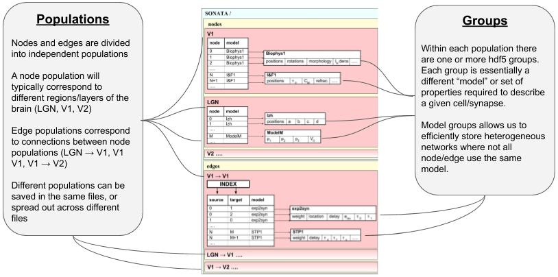

The Network Builder
===================

The class for building a brain network is :py:class:`bmtk.builder.NetworkBuilder <bmtk.builder.network.Network>`. This
should be used whether one is building a biophysically detailed network for BioNet, a point-neuron network for PointNet,
A filter-based lnp network for FitlerNet, or a population-level network for PopNet. In general, it can be used to build
any type of heterogeneous parameter multi-graph.

The process of building the network can break down into four parts:

1. Initialize the Network. Here all one needs is a unique name to identify the population of nodes - usually, the region
   being model

.. code:: python

   from bmtk.builder import NetworkBuilder

   net = NetworkBuilder("network_name")

2. Create the nodes (ie. cells) using the :py:meth:`add_nodes() <bmtk.builder.network.Network.add_nodes>` method. For
   different types/models of cells we can use separate calls to add_nodes (often with different model parameters).

.. code:: python

   net.add_nodes(N=80, model_type='Biophysical', ei='exc')
   net.add_nodes(N=20, model_type='IntFire', ei='inh', vrest=-50.0)

3. Create Connection rules between different subsets of nodes using :py:meth:`add_edges() <bmtk.builder.network.Network.add_edges>`
   method.

.. code:: python

   net.add_edges(source={'ei': 'exc'}, target={'ei': 'inh'}, connection_rule=my_conn_func, synaptic_model='e2i')
   net.add_edges(source={'ei': inh}, target={'ei': 'exc'}, connection_rule=1, synaptic_model='i2e')

4. Finally use :py:meth:`build() <bmtk.builder.network.Network.build>` and :py:meth:`save() <bmtk.builder.network.Network.save>`
   methods to build and save the model to the file

.. code:: python

   net.build()
   net.save(output_dir='/path/to/network/output/')

Building Nodes
--------------
In BMTK and SONATA a node usually is synonymous with a cell (although a node can be used to represent a population of
cells with `PopNet <./popnet.html>`_). To add a group of nodes to a network is to use the
:py:meth:`NetworkBuilder.add_nodes() <bmtk.builder.network.Network.add_nodes>`.

The only thing that is required is an integer value N for the number of individual nodes. The modeler can also pass in
any parameter they want to describe their model - although SONATA/BMTK does contain a number of reserved node parameters
that will be useful in generating an instantiable model.

.. code:: python

   net.add(N=100, model_type='biophysical', dynamics_params='rorb_params.json', morphology='rorb.swc')

In the above example, all 100 nodes share the same values for ``model_type``, ``dynamics_params``, and ``morphology``.
To have unique parameter values for each N node you only need to pass in a list or array of size N. In the below example
the ``rotation_angle_xaxis`` and ``rotation_angle_yaxis`` will be unique for every node

.. code:: python

   net.add(
      N=100,
      rotation_angle_xaxis=np.linspace(0.0, 360.0, 100),
      rotation_angle_yaxis=np.random.rand(0.0, 360.0, 100),
      model_type='biophysical',
      ...
   )

If a parameter requires compounded data you can use a tuple or a list of tuples. For example, we may want to represent a
cell’s position by a range:

.. code:: python

   net.add(N=100,
           pos_with_jitter=[(p-rand(), p+rand()) for p in positions],
           ...)

Node Representation
+++++++++++++++++++
When :py:meth:`NetworkBuilder.build() <bmtk.builder.network.Network.build>` is called, each node will be given a unique
**node_id** value, and each type model (eg each call to add_nodes) will also be given a **node_type_id**. It is possible
to set the **node_id** and **node_type_id** parameter yourself but it’s generally not a good idea.

The :py:meth:`NetworkBuilder.nodes() <bmtk.builder.network.Network.nodes>` will return an iterator of the nodes in a
network. By default, it returns all nodes but one can filter by specific property values. The nodes themselves can have
their properties accessed like a dictionary. For example to get all biophysically detailed inh neurons:

.. code:: python

   for node in net.nodes(model_type='biophysical', ei='inh'):
      x = node['position_x']
      ...

Useful Node Parameters
++++++++++++++++++++++
As mentioned above the modeler can use any parameters and values they require to represent their models. The following
are parameters that will be recognized and used by the BMTK simulator (but not necessarily required). For a complete
list see `SONATA <https://github.com/AllenInstitute/sonata/blob/master/docs/SONATA_DEVELOPER_GUIDE.md#nodes---required-attributes>`_:

.. csv-table::
   :header: "Name", "Description"
   :widths: 20, 40

   "x (or y, z)", "x positions of soma in world coordinates"
   "rotation_angle_xaxis (or y, z)", "rotation of the morphology around the soma"
   "model_type", "level of representation of neurons (biophysical, point_neuron, virtual)"
   "model_template", "String name of the template to create (eg, ctdb:Biophys1.hoc, nest:glif_lif, etc)"
   "model_processing", "Directive or function that will be applied to neuron model after creation. For Allen Cell Types models use aibs_perisomatic or aibs_allactive"
   "dynamics_params", "Channel and mechanism parameters for neuron, usually a name of a json or NeuronML file. Will overwrite model_template."
   "morphology", "Name of the detailed morphology file (usually SWC)."

Building Edges
--------------

To define different types of edges between two subsets of nodes you should use the
:py:meth:`NetworkBuilder.add_edges() <bmtk.builder.network.Network.add_edges>` method. Then once
:py:meth:`NetworkBuilder.build() <bmtk.builder.network.Network.build>` method is called the the actual connections will
be instantiated based on the **connectivity_rule** property the user defines. A typical call to add_edges would be the following

.. code:: python

   net.add_edges(
         source={'ei': 'inh'},                                 # 1
         target={'ei': 'exc', 'ephys_type': 'fast_spiking'},
         connection_rule=my_connection_func,                   # 2
         dynamic_parameters='i2e.json',                        # 3
         synaptic_model='alphaSyn',
         syn_weight=1.34e-05,
         delay=2.0
   )

1. parameters ``source`` and ``target`` are used to filter out the subset of nodes used pre-and post-synapse, respectively.
   In this case, the source population consists of all inhibitory (ei=inh) neurons, while the target population consists
   only of excitatory (ei=exc) fast-spiking neurons. If the source or target is not specified then all possible nodes will
   be used.

2. ``connection_rule`` is used to determine the number of connections between each source and the target node. If the value
   is given as an integer N then all possible source/target pairs with have N different connections. You can also pass
   in a list-of-list or a matrix. But usually, a user-defined function is used, which will be better described in the
   next section.

3. ``dynamic_parameters``, ``synaptic_model``, ``syn_weight``, and ``delay`` are all shared connection parameters. Like
   with nodes, modelers can choose whatever parameters they deem best to represent their network. A list of useful
   parameters pre-defined by BMTK and SONATA is described below.

Also, like the nodes, it is possible to have unique values for every individual edge, but it is a little more difficult.
See the section on ConnectionMap for more info.

Connection rules
++++++++++++++++
The connection_rule parameter of add_edges() method will usually be a user-defined function (but may also be an integer,
list-of-lists, or matrix). The function’s first two parameters will be source and target, Node objects whose properties
can be accessed like a dictionary. It should return an integer N for the number of connections between the source and
target, 0 or None if there is no connection.

.. code:: python

   def my_connection_func(source, target):
      src_pos = source['position']
      trg_pos = target['position']
      ...
      return N_syns

   net.add_edges(
      source={'ei': 'inh'}, target={'ei': 'exc', 'ephys_type': 'fast_spiking'},
      connection_rule=my_connection_func,
      dynamic_parameters='i2e.json',
      ...
   )

If the connection_rule function requires additional arguments, use the connection_params option:

.. code:: python

   def my_connection_func(source, target, min_edges, max_edges):
      src_pos = source['position']
      trg_pos = target['position']
      ...
      return N_syns

   net.add_edges(
      source={'ei': 'inh'}, target={'ei': 'exc', 'ephys_type': 'fast_spiking'},
      connection_rule=my_connection_func,
      connection_params={'min_edges': 0, 'max_edges': 20},
      dynamic_parameters='i2e.json',
      ...
   )

When :py:meth:`NetworkBuilder.build() <bmtk.builder.network.Network.build>` is executed my_connection_func() will be
automatically called for all possible source/target pair of nodes and the connectivity matrix will be called.

Sometimes it may be more efficient or necessary to set all incoming (or outgoing) connections in one function. For
example, we may need to limit the total number of synapses on a target. The ``iterator`` parameter allows the modeler to
change the signature and return values of their connection_rule function. By setting ``iterator`` to **all_to_one**,
instead of passing in a single source neuron it will pass in a list of all N source neurons, and will expect a
corresponding list of size N

.. code:: python

   def bulk_connection_func(sources, target):
      trg_pos = target['position']
      syn_list = np.zeros(len(sources))
      for source in sources:
         src_pos = source['position']
         ...
      return syn_list

There is also an **all_to_one** iterator option that will pair each source node with a list of all available target nodes.

Individual Edge Properties (The ConnectionMap)
++++++++++++++++++++++++++++++++++++++++++++++
Sometimes it is necessary for each edge to have unique property values. For example, the individual syn_weight value for
each synapse may vary depending on the location and type of the pre-and post-synaptic nodes. With nodes,
you can pass in a list or array of size N for each N node. But when edges are built using a connection_rule function
the exact number of connections will not be known in advance.

each call to add_edges returns a :py:class:`ConnectionMap <bmtk.builder.connection_map.ConnectionMap>` object. The
:py:meth:`ConnectionMap.add_properties() <bmtk.builder.connection_map.ConnectionMap.add_properties>` method allows us to
add individual properties for each edge using our own user defined functions. Like with our connection_rule function,
the connection_map ``rule`` function takes in a source and target node and returns a corresponding value:

.. code:: python

   def set_syn_weight_by_dist(source, target):
      src_pos, trg_pos = source['position'], target['position']
      ...
      return syn_weight

   cm = net.add_edges(....)
   cm.add_properties('syn_weight', rule=set_syn_weight_by_dist, dtypes=np.float)
   cm.add_properties('delay', rule=lambda *_: np.random.rand(0.01, 0.50), dtypes=np.float)

If the ``rule`` requires extra arguments we can use the ``rule_params`` option:

.. code:: python

   def set_syn_weight_by_dist(source, target, min_weight, max_weight):
      src_pos, trg_pos = source['position'], target['position']
      ...
      return syn_weight

   cm.add_properties(
      name='syn_weight',
      rule=set_syn_weight_by_dist,
      rule_params={'min_weight': 1.0e-06, 'max_weight': 1.0e-04},
      dtypes=np.float
   )

It is also possible to set multiple parameters in a single function. For example, for each synapse, we may want to set
the distance between the soma, and the neuronal area (soma, apical dendrites, basal dendrites, etc). To do so our ``name``
and ``dtypes`` parameters take a list, and our rule function now returns two values

.. code:: python

   def set_target_location(source, target):
      ...
      return syn_region, syn_dist

   cm.add_properties(
      name=['syn_region', 'syn_dist'],
      rule=set_syn_weight_by_dist,
      dtypes=[str, np.float]
   )

Intra-Network Connections
+++++++++++++++++++++++++
Both BMTK and SONATA support a network to be built piecemeal and combined into one at simulation time. A cortical
the region will receive inputs from many other regions, and a modeler may want to test the dynamics when different
combinations of inputs are turned on and off. Instead of building multiple models of the region with different inputs,
instead, we can build the nodes, recurrent and inter-network connections each region independently and turn them on and
off during the simulation (see `simulation config <./simulators.html#configuration-files>`_)

Creating connections between two different networks is very similar to creating recurrent connections and still use the
add_edges method. The main difference is for our ``source`` or ``target`` argument, instead of using a dictionary we must
use the :py:meth:`NetworkBuilder.nodes() <bmtk.builder.network.Network.nodes>` method of another network. For example, we
have two networks called **LGN** and **V1** and we want to create a connection type from LGN’s excitatory neurons (ei=exc)
V1’s pyramidal cells

.. code:: python

   v1 = NetworkBuilder('V1')
   ... # Build V1 network

   lgn = NetworkBuilder('LGN')
   lgn.add_nodes(N=30000, model_type='virtual', ei='exc')
   lgn.add_edges(
      source={'ei': 'exc'},                  # dict indicates source population coming from lgn_net
      target=v1.nodes('model_type': 'pyr'),  # target population coming form V1 network
      connection_rule=input_conn_fnc,
      ...
   )
   lgn.build()

When creating intra-network connections the :py:meth:`NetworkBuilder.import() <bmtk.builder.network.Network.import>`
method can be very useful.

Edge Accessor methods
+++++++++++++++++++++

:py:meth:`NetworkBuilder.edges() <bmtk.builder.network.Network.edges>`
^^^^^^^^^^^^^^^^^^^^^^^^^^^^^^^^^^^^^^^^^^^^^^^^^^^^^^^^^^^^^^^^^^^^^^

The method will return an iterator of edges filtered by edge and/or node properties. Each edge will be
represented using a :py:class:`Edge <bmtk.builder.edge.Edge>` object

Useful Edge Parameters
++++++++++++++++++++++

.. csv-table::
   :header: "Name", "Description"
   :widths: 20, 40

   "syn_weight", "synaptic weight"
   "delay", "synaptic delay, in ms"
   "model_template", "String name of the template to create an object from parameters in dynamics_params"
   "dynamics_params", "dynamic parameter overrides for edges"
   "efferent_section_id", "location of (NEURON) section where the connection will target"
   "efferent_section_pos", "distance within the (NEURON) section where synapse will target"
   "target_sections", "A list of neuronal sections where the synapse will target (soma, axon, apical, basal). When used in place of section_id, BioNet will randomly select a section on the target neuron"
   "distance_range", "A range in um of the distance from the soma, used along with target_sections param to randomly target certain areas of the post-synaptic neuron."
   "weight_function", "Name of the detailed morphology file (usually SWC)."

Saving and Building
-------------------
Once all calls to add_nodes and ad_edges have been made, use the build() method to actually complete and fully
instantiate the network. Certain accessor functions, like
:py:meth:`NetworkBuilder.nodes() <bmtk.builder.network.Network.nodes>` and
:py:meth:`NetworkBuilder.edges() <bmtk.builder.network.Network.edges>` will not work until all the edges have been
completed. Depending on the size of the network and the complexity of the connectivity rules, it can take anywhere from
less than a second to days to build the full model.

The :py:meth:`NetworkBuilder.save(output_dir=’/path/to/output/net/’) <bmtk.builder.network.Network.save>` method will
write the network to a disk in SONATA format at the given output_dir path. By default nodes and edges will be written to
different files using the network names to determine the sonata file names. The
:py:meth:`NetworkBuilder.save_nodes() <bmtk.builder.network.Network.save_nodes>` and
:py:meth:`NetworkBuilder.save_edges() <bmtk.builder.network.Network.save_edges>` functions may also used to only write
out the nodes or the edges, respectively.

Network Format
--------------
This is a brief overview of how NetworkBuilder saves the network’s nodes and edges files. As mentioned BMTK uses the
SONATA format, so more in-depth descriptions may be
`found here <https://github.com/AllenInstitute/sonata/blob/master/docs/SONATA_DEVELOPER_GUIDE.md#representing-networks-of-neurons>`_.
Opening the HDF5 file will require a hdf browser like HDFView, or a library like h5py. You can also use
`pySONATA <https://github.com/AllenInstitute/sonata/tree/master/src/pysonata>`_ or
`libSONATA <https://github.com/BlueBrain/libsonata>`_ which are API’s for reading in SONATA files

Advanced Features
-----------------
