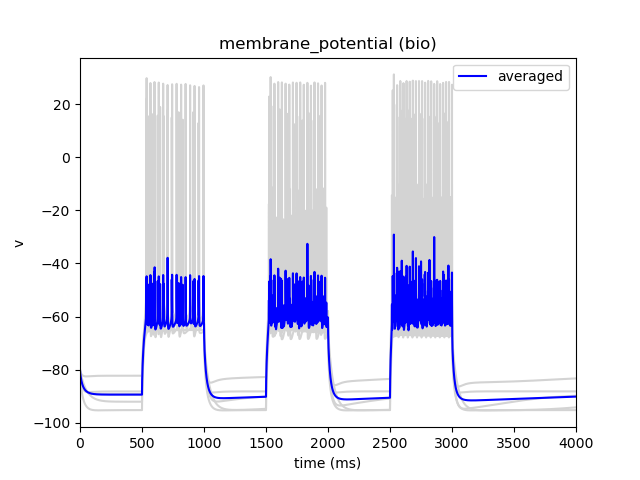

:orphan:

Current Clamp [IClamp] Stimulation
==================================

One of the most common way to provide stimulus into a network of cells is to directly inject a current 
into all or a subset of cells. This can be easily done in bmtk using the "**inputs**" section of the 
`SONATA simulation config <https://alleninstitute.github.io/bmtk/simulators.html#creating-the-environment>`_.
For example, to provide an single 0.15 pA injection into all cells starting at 1000 ms and ending at 1500 ms;
open the simulation *json* configuration file with your prefered text-editor and add the following subsection
to the **inputs** section:

.. code:: json

   {
     "inputs" {
       "current_clamp": {
         "module": "IClamp",
         "input_type": "current_clamp",
         "node_set": "all",
         "amp": 0.1500,
         "delay": 1000.0,
         "duration": 500.0,
         "section_name": "soma"
       }
     }
   }

Here "current_clamp" is the name we arbitarily give for this particular input, **module** and **input_type** are 
specify the type of stimulus we are using, and the other parameters are used to define the attributes of our
current clamp (see parameter options below). 

After saving the file and run the simulation we should see the effect of a direct current injection into the 
soma of our cell model.

.. figure:: _static/images/iclamp_stim_single.png
   :scale: 100%

We can also have the option of add multiple independent current clamps in the same simulation, where each one 
may have a different injection trace, different onset and offset, target different subset of cells or be placed
at different locations. For example to apply a series of three different current injections with an increasing 
amplitude we can just update the json file accordingly

.. code:: json

   {
     "inputs" {
       "current_clamp_1": {
         "module": "IClamp",
         "input_type": "current_clamp",
         "node_set": "all",
         "amp": 0.1500,
         "delay": 500.0,
         "duration": 500.0,
         "section_name": "soma"
       },
       "current_clamp_2": {
         "module": "IClamp",
         "input_type": "current_clamp",
         "node_set": "all",
         "amp": 0.1750,
         "delay": 1500.0,
         "duration": 500.0,
         "section_name": "soma"
       },
       "current_clamp_3": {
         "module": "IClamp",
         "input_type": "current_clamp",
         "node_set": "all",
         "amp": 0.2000,
         "delay": 2500.0,
         "duration": 500.0,
         "section_name": "soma"
       }
     }
   }

The above is a sequence of different current clamps done in series, but it is possible to have multiple current 
clamps run in parallel too.

Advanced Stimulus Inputs
------------------------

Where there are only a few step currents it is easy enough to use the above method of adding mutliple current
clamps in series or in parallel. However for more advanced patterns of stimuli - like randomized noise, ramps, 
sine waves, etc. - the above method becomes impracticle. Instead of just passing in a single step-block, BMTK
provides methods for modifying the **input_type** to pass in lists or even external files.

List of Amplitudes
++++++++++++++++++

In the above example, instead of using three separate current clamps, we can instead specify just a single one
whose amplitudes change over time:

.. code:: json

   {
     "inputs" {
       "current_clamp_list": {
         "module": "IClamp",
         "input_type": "current_clamp",
         "node_set": "biophys_cells",
         "amp": [0.1500, 0.1750, 2500.0],
         "delay": [500.0, 0.1500.0, 2500.0],
         "duration": [500.0, 500.0, 500.0] 
       }
     }
   }

**Note**
 * Here the "**duration**" is optional and used to set the injection current back to 0. If not specified BMTK will
   just update the **amp** value of the current injection at the next **delay**
 * In many siutations like the one above, replace three separate current clamps with a list will produce the same results, however 
    it is not guarenteed. 

Storing Amplitude Traces in a CSV file
++++++++++++++++++++++++++++++++++++++

For even more complex current injection traces, users can create and pass in a csv file of the trace. The csv file
should have two columns, one containing the changes in amplitudes and a corresponding one for the respective onsets, labeled
**amps** and **timestamps** respectivly (although this headers can be changed, see options below) with a space delimiter
(which can be changed using options below). 

.. list-table:: custom_current_traces.csv
   :widths: 25 25
   :header-rows: 1

   * - timestamps
     - amps
   * - 800.0
     - 0.1500
   * - 810.0
     - 0.1600
   * - 820.0
     - 0.1700
   * - 830.0
     - 0.1800
   * - ...
     - ...

Then once the file has been saved update the json configuration. To do so we must make sure the **input_type** option is
set to *csv*, and instead of options like `amp`, `delay`, and `duration` we just need to point bmtk to the `file` path of 
our csv:

.. code:: json

   {
     "inputs" {
       "current_clamp_csv": {
         "module": "IClamp",
         "input_type": "csv",
         "node_set": "all",
         "file": "custom_current_trace.csv"
        }
      }
   }

Using Allen Cell-Types Database Sweeps
++++++++++++++++++++++++++++++++++++++

In the `Allen Cell-Types Database <https://celltypes.brain-map.org/data>`_ there is the option to download the ephys
nwb files which include "sweeps" of current injection used to classify various cells and optimize the model parameters.

Using the `Download data` button will download a nwb file containing various "sweeps" (as can be seen using the 
`select stimulus type` and `Select sweep` buttons). You can recreate these sweeps with BMTK using this downloaded file.
As before, we need to update the *json* simulation configuration file, this time setting **input_type** to a value 
`allen` or `nwb`, specify the `file` path of the nwb, and the `sweep` number to use.

.. code:: json

    {
      "inputs" {
        "current_clamp_nwb": {
          "module": "IClamp",
          "input_type": "allen",
          "node_set": "all",
          "file": "/626159623_ephys.nwb",
          "sweep_id": 29,
        }
      }
    }

IClamp parameters
-----------------
**module \: string** 
    Should always be set to a value `IClamp`

**input_type \: string**
    The format of the input, options: `current_clamp`, `csv`, `file` (same as `csv`), `allen`, or `nwb` (same as `allen`)

**node_set \: string**, **dict**, or **list**
    Specify the subset of cells which the injection current will be applied. The default value of `all` will 
    input the same current clamp to "all" cells in the network. Alternatively, you can filter by properties: 
    
    .. code:: python

          "node_set": {
            "population": "v1"
            "location": "VisL4",
            "model": "PValb"
          }

    Or pass in a list of node-ids
    
    .. code:: python
    
        "node_set": [0, 100, 200, 300, 400]
    

**section_name [optional] \: string**
    For morphologically detailed cells, the section of the cell that the current clamp will be placed. options 
    include `soma`, `axon`, `dend`, `apic`, `other`; default value `soma`

**section_index [optional] \: integer**
    For morphologically detailed cells, the NEURON designated branch of the given section where the current clamp will be placed.

**section_dist [optional] \: float [0, 1)**
    For morphologically detailed cells, the distance along the branch where the current clamp will be placed.

**file \: string**
    When using a `csv` or `nwb` **input_type**, path the file containing current clamp trace (or sweep) and is **[required]**.

|

*Parameters applicable only to current_clamp input_type*

**amp \: float**, **list of floats**
    Amplitudes (pA) of current injection.

**delay \: float**, **list of floats**
    Current injections onsets (ms) started from simulation time 0.0

**duration \: float**, **list of floats**
    Current injections durations (ms).

|

*Parameters applicable only to csv input_type*

**separator [optional] \: string**
    csv file delimiter used to distinguish columns; defaul " " (single space)

**timestamps_column [optional] \: string**
    Header name for column in csv used to specify changes in amplitude values; default `timestamps`

**amplitudes_column [optional] \: string**
    Header name for column in csv used to specify ampltidue changes at each given timestep; default `amps`

|

*Parameters applicable only to allen input_type*

**sweep_id \: integer**
    The sweep number of the wanted stimulus pattern found in the nwb file

**downsample [optional] \: float**
    When specified, will attempt to downsample the injection current trace. As a good practice it is optimal
    to set the value to the same as the `dt` in the simulation configuration. Since for most Cell-Type sweeps 
    the rate of current injection changes is typically much smaller than the simulation `dt`.

**sweep_window [optional] \: [float, float]**
    Instead of using the full sweep, which is often longer than the simulation time, selection a portion of
    the sweep time from starting specifying a `0 <= start-time < stop-time < sweep-total-time` (in ms).
