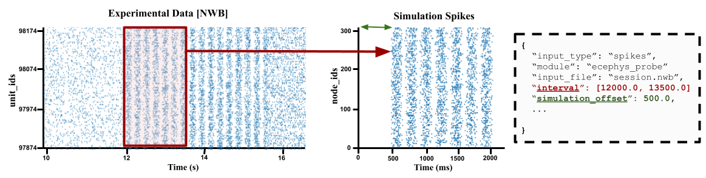

:orphan:

*****************************************************************
Spikes Stimulus with (NWB) Extracellular Electrophysiology Probes
*****************************************************************

The goal of the `ecephys_probe` inputs module is to drive a network simulation using experimental data
recorded using extracellular electrophysiology (ecephys) multi-channel probes. Typically, BMTK and SONATA
uses either SONATA Spike-Train files or csv files to create virtual cells to provide synaptic inputs to
the cells in our model. And while SONATA are can be converted and/or generated based on observed data, the
`ecephys_probe` module allows us directly incorpate in-vivo spike recordings into our in-silco simulation.

This module uses `NWB 2.0 <https://pynwb.readthedocs.io/en/stable/tutorials/index.html>`_ formated files to
fetch unit spike-times data and convert them into synaptic stimuli. It was mainly designed for use with 
`Allen Institute Visual Coding <https://allensdk.readthedocs.io/en/latest/visual_coding_neuropixels.html>`_ and
`Visual Behavior <http://portal.brain-map.org/explore/circuits/visual-behavior-neuropixels>`_ neuropixels data.
But can be used with external public ecephys session data, like many of those found on 
`DANDI <https://dandiarchive.org/>`_ provided they have units with spike-times.

Quick Start Guide
#################

For pre-built examples of network simulations that use in-vivo ecephys probe data there are a number of
examples in the BTMK **examples/** folder; including ones for `BioNet (NEURON) <INSERT_LINK>`_ and 
`PointNet (NEST) <INSERT_LINK>`_. Once BMTK is installed on your system just run a simulation using one
of the simulation JSON configs:

.. code:: bash

    $ python run_bmtk.py config.simulation.x.json

Using the `ecephys_probe` module in your simulation is all done through the 
`simulation simulation config <./simulators.html#configuration-files>`_ file. Using your preferred text
editor you can open up the simulation json configuration file, and update the **inputs** section to 
add or modify the `ecephys_probe` modules.

For example, suppose our network includes virtual thalamic **LGN** cells that synapse onto our cortical cells,
and we want to use spike trains from Visual Coding Session_715093703.nwb file (See `below <INSERT_LINK>`_ on 
tricks for downloading nwb files), then we can add the following section to our json file:

.. code:: json

    {
      "inputs": {
        "LGN_spikes": {
          "input_type": "spikes",
          "module": "ecephys_probe",
          "input_file": "./session_715093703.nwb",
          "node_set": {"population": "LGN"},
          "mapping": "sample_with_replacement",
          "units": {
            "location": "LGd"
          },
          "interval": [10000.0, 12000.0]
        }
      }
    }

**Where**
 * **LGN_spikes** is the unique arbitary name we give for this particular module block (there can be multiple input blocks in the same simulation).
 * We set **"input":** *spikes* and **"module":** *"ecephys_probe"* to instruct BMTK (and any other SONATA compliant simulator) to create virtual spike
   trains using NWB ECEPhys Probe data. This value cannot be changed
 * **input_file** is the path to our download NWB file.
 * **node_set** is used to select the sub-population of cells to use for the LGN spikes inputs, in this case use all cells in the **LGN** cell population (see `the following <https://github.com/AllenInstitute/sonata/blob/master/docs/SONATA_DEVELOPER_GUIDE.md#node-sets-file>`_ for more information on SONATA node-sets).
 * **mapping** is the method to map the NWB units to our model nodes, in this case indicating we want to randomly assign NWB units to our network cells (with replacement in case there are fewer NWB units than cells). 
 * **units** let's us filter out the exact units in our NWB file to use, here we only want the spike trains of units where the location is from the LGd.
 * **interval** let's us filter spike trains in the NWB file based on a given time window in ms, in this case we only want spike trains that occured between 10-12 seconds (which by default will be converted 0-2 seconds in the simulation) 

The module also allows you to use multiple NWB files at a time, where the sampling of units in the use of our simulation will be done across all NWB input_file's

.. code:: json

    {
      "inputs": {
        "LGN_spikes": {
            "input_type": "spikes",
            "module": "ecephys_probe", 
            "input_file": ["./session_715093703.nwb", "./session_733123887.nwb"],
            "node_set": {"population": "LGN"},
            "mapping": "sample_with_replacement",
            "units": {
                "location": "LGd"
            },
            "interval": [10000.0, 12000.0]
        }
    }

Or if you have multiple populations that you want to use to drive input into our model, you can just use the module multiple times:

.. code:: json

    {
      "inputs": {
        "LGN_spikes": {
            "input_type": "spikes",
            "module": "ecephys_probe", 
            "input_file": ["./session_715093703.nwb", "./session_733123887.nwb"],
            "node_set": {"population": "LGN"},
            "mapping": "sample_with_replacement",
            "units": {
                "location": "LGd"
            },
            "interval": [10000.0, 12000.0]
        },

        "hippocampus_spikes": {
            "input_type": "spikes",
            "module": "ecephys_probe", 
            "input_file": ["./session_715093703.nwb", "./session_733123887.nwb"],
            "node_set": {"population": "LGN"},
            "mapping": "sample_with_replacement",
            "units": {
                "location": ["CA1", "CA3", "Po"]
            },
            "interval": [135000.0, 137000.0]
        }
    }

Parameters
##########
* **input_file:** - *string* or *list[String]* - A path or list of paths to NWB file(s) contain ECEPhys units spike-time recordings.
* **node_set** - *string* or *dict* - A filter for node (sub)population to use when assing NWB units to spikes.
* **mapping** - *string* - The strategy by which NWB units are assinged to simulation nodes. Current options: units_maps, sample, sample_with_replacement.
* **units** - *string* or *dict* - Used to filter out which units in NWB **input_file** are to be used by module, if empty will use all possible units from file.
* **missing_ids** - *string* - Determines what happens if a mapping fails or unit_id does not exists. Current options: fail (*default*), warn, ignore. 
* **save_map** - *string* - A path to a csv file in the output folder where, if specified, will save the units_maps of current simulation. Will overwrite existing file if exists.
* **interval** - *list[float (ms), float (ms)]* or *dict* or *list[intervals or dict]* - Filters spike-times in the NWB **input** file, using using a [*start*, *stop*] interval (ms), or if a dictionary is used tries to parse interval from the NWB intervals table. By default will shift interval to time-step 0.0 ms in simulation, use **interval_offset** to shift to anther value.
* **interval_offset** - *float* - When using the **interval** option to filter spike-times, determines offset for simulation. Default value 0.0.

Advanced Features
#################

Mapping and Filtering NWB units
===============================

In the simulation each **unit** in NWB must be mapped onto a SONATA **node** for it's spike trains to be used. The `mapping` and `units` options
work in conjunction to control how this is done.

sample and sample_with_replacement
^^^^^^^^^^^^^^^^^^^^^^^^^^^^^^^^^^

To randomly assign unit_ids to node_ids you can use values "sample" or "sample_with_replacement" in the `mapping` option. The former is the same
as sample without replacement, which may cause issues if there are fewer units than nodes. 

By default all units in the NWB file will be used, but you can use the `units` option to filter out only those units which meet a certain critera.
It must be a dictionary of conditionals that will preform a intersection (eg AND operation). For example to get only units with a "good" value in
the "quality" column and comes from channel_ids in 850261194-850261196:

.. code:: json

    {
      "mapping": "sample",
      "units": {
        "quality": "good",
        "channel_id": [850261194, 850261195, 850261196]
      }
    }

If you need more advanced comparisions you can specify the column query in the format `"query": {"column": <col>, "operation": <operator>, "value": <value>}`.
For example to get only VISp units that having "firing_rate" between 5.0 and 10.0 Hz:

.. code:: json

    {
      "mapping": "sample_with_replacement",
      "units": {
        "location": "VISp",
        "fr_gt": {"column": "firing_rate", "operation": ">=", "value": 5.0},
        "fr_lt": {"column": "firing_rate", "operation": "<=", "value": 10.0} 
      }
    }

Note: The options available for filter will vary from NWB file to NWB file.

units_map
^^^^^^^^^

If you know how each unit should be mapped to each node and stored in a csv file, then you can use the "units_map" value in the `mapping` option.

.. code:: json
    
    {
      "mapping": "units_map",
      "units": "/path/to/units2nodes_map.csv"
    }

The *units2nodes_map.csv* is a space-separated csv file where each row contains a SONATA node identifier (Population + node_id) and a corresponding
units_id from a NWB file with manditory columns **population**, **node_ids**, **unit_ids**

.. list-table:: units2nodes_map.csv
   :widths: 25 25 25
   :header-rows: 1

   * - population
     - node_ids
     - unit_ids
   * - LGN
     - 0
     - 951090537
   * - LGN
     - 1
     - 951090804
   * - LGN
     - 2
     - 951091012
   * - ...
     - ...
     - ...

Filtering Spike Times by Intervals and Epochs
=============================================

In-vio Session data typically are much longer and contains much more stimuli/epochs than that which is of interest to our own simulations. To simulate
we can use the `interval` option to only use spikes that occur during a period of interest. 

By default the `ecephys_probe` module will shift it to start at zero. So for example if the time-window is set to between 10 and 20 seconds, then a 
spike that is recorded at 11.5 seconds in the NWB will now occur at time 1.5 seconds in the simulation. You can use the `simulation_offset` option
to adjust where spikes starts in the simulation.

intervals ranges
^^^^^^^^^^^^^^^^

The easies way to to specify a time-window is to specify a range [*start_time*, *stop_time*] in milliseconds. For example if you know the period of
interest you are interested occurs in the probe data between minutes 30 to 32

.. code:: json

    "interval": [1800000.0, 1920000.0]

If you have multiple NWB files, each one with a unique period of interest, you can also pass in a list of ranges

.. code:: json

    {
      "input_file": ["./session_71509.nwb", "./session_73312.nwb", "./session_89923.nwb"],
      "interval": [[10000, 12000], [15000, 17000], [24000, 26000]]
    }

Intervals and Epoch Tables (aka Stimulus Table)
^^^^^^^^^^^^^^^^^^^^^^^^^^^^^^^^^^^^^^^^^^^^^^^

NWB session files can contain intervals/epochs tables that can tell you the exact time during a session a stimulus or condition was being presented 
to the subject. If instead of passing an a time range to `interval`, you pass in a `dictionary`, the `ecephys_probe` module will automatically try
to create a time-window filter using the columns from the intervals table.

For example, if you want to get spikes that only occurred when a drifting gratings was presented to subject with a specific a 90 degrees orientation
and < 5 Hz frequency:

.. code:: json

    "interval": {
        "stimulus_name": "drifting_gratings",
        "temporal_frequency": {"column": "temporal_frequency", "operation": "<", "value": 5.0},
        "orientation": 90.0
      },

Only the "stimulus_name" value is required. The rest of the options availble to filter on the interval or epoch will vary from both NWB to NWB and
from each interval to interval.

As with interval ranges, when working with multiple NWB files you can pass in a list a interval filters dictionaries.

One important issue to note is that often a query on the stimulus table will return multiple intervals. For instance drifting gratings with orientation
90deg and freq < 5 Hz may be presented to subject multiple times over the full session. By default the module will select the first one, but you
can use special option "interval_index" to get a specific one. For example to get the fifth time a drifting grating is presented:

.. code-block:: json

    "interval": {
        "interval_name": "drifting_gratings",
        "interval_index": 5
      }

By default the value is set to 0 (the first time that particular interval occurs). But you can also pass in options 'random' (select one interval at 
random), 'first', 'last', or 'full_range' (returns the minimum start-time and maximum stop-time over all intervals).

Individual unit interval
^^^^^^^^^^^^^^^^^^^^^^^^

It is also possible to assign each indivdiual unit_id a unique interval of interest when using the "units_maps" option for in the `mapping` attribute.
To do so just update the units-to-nodes csv file to include columns **start_times** and **stop_times**, both in units of milliseconds:

.. list-table:: units2nodes_map.csv
   :widths: 25 25 25 25 25
   :header-rows: 1

   * - population
     - node_ids
     - unit_ids
     - start_times
     - stop_times
   * - LGN
     - 0
     - 951090537
     - 10034.0
     - 13124.0
   * - LGN
     - 1
     - 951090804
     - 11130.5
     - 12999.8
   * - LGN
     - 2
     - 951091012
     - 500.0
     - 2501.3
   * - ...
     - ...
     - ...
     - ...
     - ...

Using the AllenSDK to download Neuropixels data
###############################################

