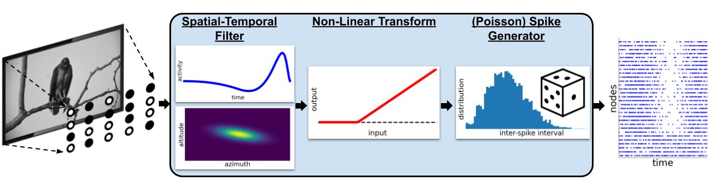

FilterNet
=========

.. figure:: _static/images/bmtk_architecture_filternet_highlight.jpg
   :scale: 40%

FilterNet will simulate the effects of visual stimuli onto a receptive field. It uses LGNModel simulator as a backend, which
uses neural filters to simulate firing rates and spike trains over a given time course and stimuli. It is based on a
`linear-nonlinear-Poisson cascade model <https://en.wikipedia.org/wiki/Linear-nonlinear-Poisson_cascade_model>`_
with options for choosing different types of spatial, temporal, or spatio-temporal units that have already been
optimized to closely mimic mammalian thalamic cells:

FilterNet is very useful for generating spike-trains that will be used as the inputs for simulations running in BioNet,
PointNet, or PopNet. The procedure is as follows:

1. Generate the receptive field network.
2. Use FilterNet to play images and movies against the receptive field and generate responses for each unit.
3. Connect the receptive field network created in step #1 to some higher-level cortical circuit.
4. Use the spike trains generated in Step #2 to see how the high-level cortical circuit would respond to different stimuli.

Inputs
------
Currently, FilterNet allows for a number of different types of custom and pre-aligned types of stimuli. To change the
type of stimuli requires updating the inputs section in the simulation_config.json file like above.

Movie
+++++
Allows playing a custom movie file in the form of a three-dimension matrix saved in a npy file.

.. code:: json

   {
      "movie_input": {
         "input_type": "movie",
         "module": "movie",
         "data_file": "/path/to/my/movie.npy",
         "frame_rate": 30.0
      }
   }

* movie: Link to a 3-dimensional (x, y, time) matrix representing a movie
* frame_rate: frames per second

Grating
+++++++
Plays a drifting grating across the screen

.. code:: json

   {
      "gratings_input": {
         "input_type": "movie",
         "module": "graiting",
         "row_size": 120,
         "col_size": 240,
         "gray_screen_dur": 0.5,
         "cpd": 0.04,
         "temporal_f": 4.0,
         "contrast": 0.8,
         "theta": 45.0,
         "phase": 0.0
      }
   }

* row_size, col_size: width and heigth dimensions of screen in pixels.
* grapy_screen_dur: displays an optional gray screen for a number of seconds before the grating starts. (default: 0)
* cpd: spatial frequncy represented as cycles per degree. (default: 0.05)
* temporal_f: temporal frequency in Hz. (default: 4.0)
* theta: orientation angle, in degrees (default: 45.0)
* phase: temporal phase, in degrees (default: 0.0)
* contrast: the maximum constrast, must be between 0 and 1.0 (default: 1.0)

Full Field Flash
++++++++++++++++
Creates a bright (or dark) flash on a gray screen for a limited number of seconds

.. code:: json

   {
      "full_field_flash": {
         "input_type": "movie",
         "module": "full_field_flash",
         "row_size": 120,
         "col_size": 240,
         "t_on": 1000.0,
         "t_off": 2000.0,
         "max_intensity": 20.0
      }
   }

* row_size, col_size: width and height dimensions of screen in pixels.
* t_on: time (ms) from the beginning on when to start the flash
* t_off: length (ms) of flash
* max_intensity: intensity of screen during flash (>0.0 is brighter, <0.0 is darker) compared to a gray screen.

Looming
+++++++
Creates a spreading black field originating from the center.

.. code:: json

   {
      "looming_input": {
         "input_type": "movie",
         "module": "looming",
         "row_size": 120,
         "col_size": 240,
         "frame_rate": 1000.0,
         "gray_screen_dur": 0.5,
         "t_looming": 1.0
      }
   }

* row_size, col_size: width and height dimensions of screen in pixels.
* frame_rate: frames per second
* gray_screen_dur: duration of the initial grey screen (seconds)
* t_looming: time of the looming movie (seconds).
