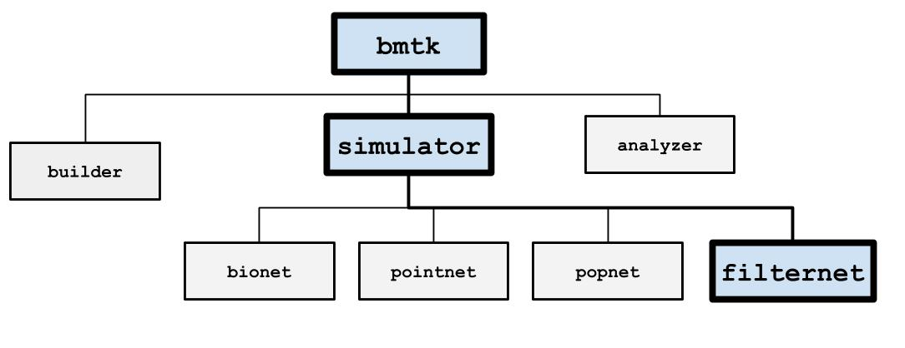

FilterNet
=========



FilterNet will simulate the effects of visual stimuli onto a receptive field. It uses LGNModel simulator as a backend, which
uses neural filters to simulate firing rates and spike trains over a given time course and stimuli. It is based on a
`linear-nonlinear-Poisson cascade model <https://en.wikipedia.org/wiki/Linear-nonlinear-Poisson_cascade_model>`_
with options for choosing different types of spatial, temporal, or spatio-temporal units that have already been
optimized to closely mimic mammalian thalamic cells:


.. figure:: _static/images/lnp_model.jpg
   :scale: 60%


FilterNet is very useful for generating spike-trains that will be used as the inputs for simulations running in BioNet,
PointNet, or PopNet. The procedure is as follows:

1. Generate the receptive field network.
2. Use FilterNet to play images and movies against the receptive field and generate responses for each unit.
3. Connect the receptive field network created in step #1 to some higher-level cortical circuit.
4. Use the spike trains generated in Step #2 to see how the high-level cortical circuit would respond to different stimuli.


Inputs
------
Currently, FilterNet allows for a number of different types of custom and pre-aligned types of stimuli. To change the
type of stimuli requires updating the inputs section in the simulation_config.json file like above.

Movie
+++++
Allows playing a custom movie file in the form of a three-dimension matrix saved in a npy file.

.. code:: json

   {
      "movie_input": {
         "input_type": "movie",
         "module": "movie",
         "data_file": "/path/to/my/movie.npy",
         "frame_rate": 1000.0,
         "normalize": true
      }
   }

* movie: Link to a 3-dimensional (time, x, y) matrix representing a movie (where time is equal to the number of frames in the movie).
* frame_rate: frames per second
* normalize: Allow the option to normalize the input movie to have contrast values between [-1.0, +1.0].
  * If set to true then FilterNet will attempt to infer the current range of the original movie from the data (most movies use contrast between [0, 255] or [0.0, 1.0].
  * If the original movie has a unique range, users can specify the min/max contrast for the original movie ```"normalize": [0.0, 100.0]```

Grating
+++++++
Plays a drifting grating across the screen

.. code:: json

   {
      "gratings_input": {
         "input_type": "movie",
         "module": "graiting",
         "row_size": 120,
         "col_size": 240,
         "gray_screen_dur": 0.5,
         "cpd": 0.04,
         "temporal_f": 4.0,
         "contrast": 0.8,
         "theta": 45.0,
         "phase": 0.0
      }
   }

* row_size, col_size: width and heigth dimensions of screen in pixels.
* grapy_screen_dur: displays an optional gray screen for a number of seconds before the grating starts. (default: 0)
* cpd: spatial frequncy represented as cycles per degree. (default: 0.05)
* temporal_f: temporal frequency in Hz. (default: 4.0)
* theta: orientation angle, in degrees (default: 45.0)
* phase: temporal phase, in degrees (default: 0.0)
* contrast: the maximum constrast, must be between 0 and 1.0 (default: 1.0)


Full Field Flash
++++++++++++++++
Creates a bright (or dark) flash on a gray screen for a limited number of seconds

.. code:: json

   {
      "full_field_flash": {
         "input_type": "movie",
         "module": "full_field_flash",
         "row_size": 120,
         "col_size": 240,
         "t_on": 1000.0,
         "t_off": 2000.0,
         "max_intensity": 20.0
      }
   }

* row_size, col_size: width and height dimensions of screen in pixels.
* t_on: time (ms) from the beginning on when to start the flash
* t_off: length (ms) of flash
* max_intensity: intensity of screen during flash (>0.0 is brighter, <0.0 is darker) compared to a gray screen.


Looming
+++++++
Creates a spreading black field originating from the center.

.. code:: json

   {
      "looming_input": {
         "input_type": "movie",
         "module": "looming",
         "row_size": 120,
         "col_size": 240,
         "frame_rate": 1000.0,
         "gray_screen_dur": 0.5,
         "t_looming": 1.0
      }
   }

* row_size, col_size: width and height dimensions of screen in pixels.
* frame_rate: frames per second
* gray_screen_dur: duration of the initial grey screen (seconds)
* t_looming: time of the looming movie (seconds).


Optimizations Techniques
------------------------
The time required to generate spikes will depending on the number of cells in the network, the stimulus type, complexity of the cell-models; among
other factors. The full simulation time can take a few seconds to a few hours. The following options may sometimes be utilized in order to 
significantly speed up the process.


Parallelization with MPI
++++++++++++++++++++++++
The `MPI <https://www.mpi-forum.org/docs/>`_ library allows the simulation to be parallelized across multiple processors and machines for use in an 
HPC cluster or even on a single machine with multiple cores. FilterNet can take advantage of using MPI automatically. Modelers will need the following
installed on their machine:
* Either `OpenMPI <https://www.open-mpi.org/>`_ or `MPICH2 <https://www.mpich.org/>`_ 
* `mpi4py <https://mpi4py.readthedocs.io/en/stable/>`_

On most HPC clusters these will be already installed. For personal machines you can often install using either `pip install mpi4py` or 
`conda install -c conda-forge mpi4py`. Then to run across <N> different cores execute your run_filternet.py script using

```bash
$ mpirun -n <N> python run_filternet.py config.json
```

Or if using a scheduler like slurm you can often use the `srun` command instead (instructions for scheduling parallel jobs on an HPC will vary depending
on the institute).

The results will be the same as if running FilterNet on a single core, the results stored in the same directory as specified in the config file.


Numba
+++++
You can also optimize FilterNet run-time using the `Numba <https://numba.pydata.org/>`_ python libary (with and without MPI). To install numba in your python
environment:

```bash
$ pip install numba
```
