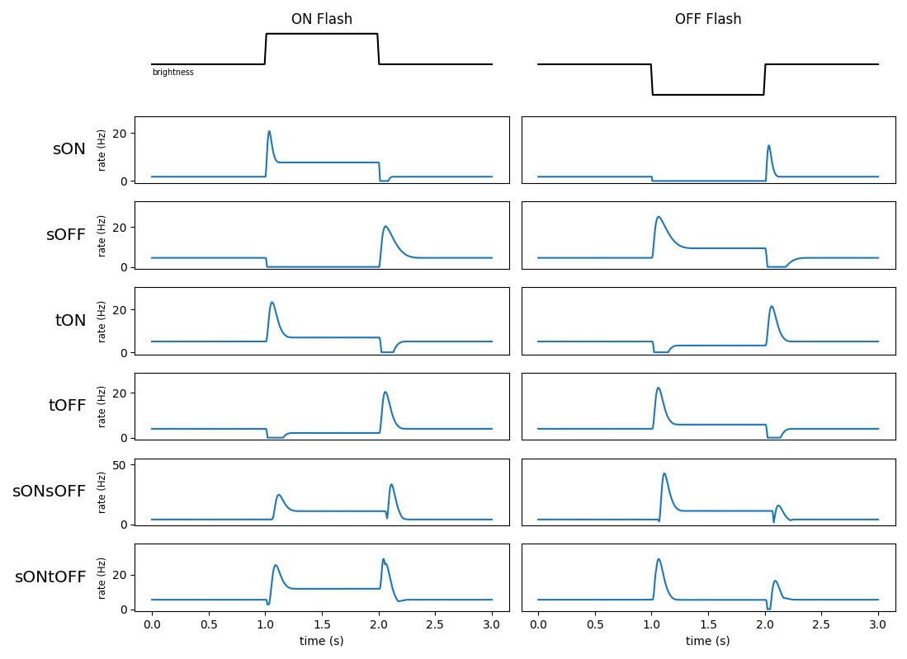
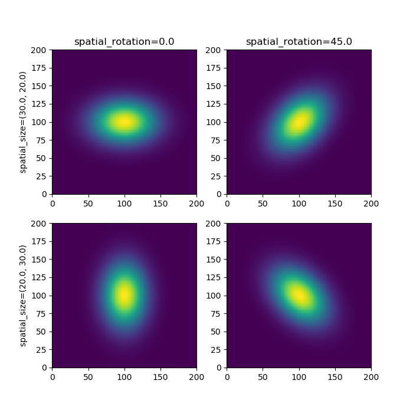
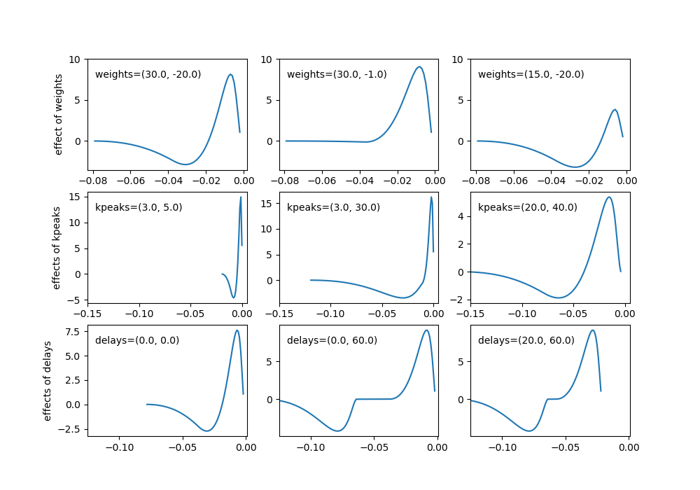

################################
FilterNet - Visual Filter Models
################################

.. note::
    The proceeding page refers to the model types and parameters for LGN (e.g. visual) filters. 
    :doc:`For information about auditory filters please click on this link <filternet_auditory_models>`.

Model Types
===========

FilterNet's LGN submodule attempts to recreate behavior of the major cell-types in the early visual area, 
the retina and thalamic relay. These cells-types are mainly classified by how their firing-rate changes to 
an increase (**ON** signal) or decrease (**OFF** signal) of brightness in their immediate visual field. 
ON-cells are excited by an increase in brightness and are depressed by darkness. OFF-cells have the 
opposite reaction. The cells are also classified by if their reaction is sustained (**s**) or transient 
(**t**) for the duration of the change in the visual field.

As such the main base-line cell models used in by FilterNet are ``sOFF`` (sustained-ON), 
``sOFF`` (sustained-OFF), ``tON`` (transient-ON), and ``tOFF`` (transient-OFF).  

Some cells may also have both transient and sustained sub-systems, and can display transient/sustained 
excitation by both ON and OFF signals in their visual field. These include ``sONsOFF``, ``sONtOFF``, and 
``LGNOnOFFCell``.

The following shows examples model types and their responses to both an ON and OFF full field flash stimuli.

Besides the core models (``sON``, ``sOFF``, ``tON``, ``tOFF``, ``sONsOFF``, ``sONtOFF``), FilterNet 
also includes a number of built in subtypes that refer to their temporal frequency (TF); ex ``sON_TF4``, 
``tOFF_TF8``, etc. These have the same behavior, but will have small optimizations based experimental 
data taken from (`Durant et. al 2016 <https://doi.org/10.1523/JNEUROSCI.1741-16.2016>`_,
`Billeh et. al 2019 <https://doi.org/10.1016/j.neuron.2020.01.040>`_). These cells will have an optimal experimentally 
shown response at the given frequency at which the grating image moves.

Representation in SONATA 
------------------------

In the SONATA circuit format, to assign an invidiual cell or cell-type a specific you must use the ``model_type`` and 
``model_template`` attributes. ``model_type`` must be set to either **virtual** or **filter**, so BMTK and other 
simulators know it's a filter cell (and not a multi-compartment, LIF, or other type of cell). And the ``model_template``
value must be set to **lgnmodel:<MODEL>** where **<MODEL>** is any one of the available models (ex ``sON``, ``sOFF``, 
etc).

In the BMTK :doc:`NetworkBuilder <builder>` you can set a collection of 100 cells to be ``tON`` using the following:

.. code:: python
   :emphasize-lines: 4

    net.add_nodes(
        N=100,
        model_type='filter',
        model_template='lgnmodel:tON',
        dynamics_params='tON_params.json',
        x=np.random.uniform(0.0, 240.0, size=100),
        y=np.random.uniform(0.0, 120.0, size=100)
    )

Model Parameters
================

While the model-type describes the general behavior of the cell, the exact shape of the response is dependent on 
individual properties of the cell/cell-types. Including how much of the visual field does each cell cover, the intensity 
of response, and the shape of the decay/recovery.

All cell models have both a spatial and temporal filter used when integrating visual stimuli into firing rate response 
rates.

Spatial Filter Parameters
-------------------------

The spatial filter (along with the cells x, y coordinates) is used to define which part of the visual field will trigger a response in each individual cell. The response is a gaussian centered at cell location (x, y) using the following properties:

* ``spatial_size`` (**float**, **float**) - The row and column spread of the filter, specifically the standard 
  deviations (std) of the Gaussian, default value (1.0, 1.0). 
* ``spatial_rotation`` (**float**) - The rotation angle of the Gaussian filter in degrees; default value 0.0.

The following image shows how spatial_size and spatial_rotion filter looks for a cell at location (100.0, 100.0)

.. admonition:: Note About Coordinates
   :class: note 

   By default, the (x, y) coordinates of each cell should match be within the same spatial coordinates as the row and 
   column pixel coordinates of numpy matrix/movie file, respectively. If a  movie has 240x120 pixels, (row_size x 
   column_size), then it has pixel coordinates (0, 0) at the top left corner and (240, 120) at the bottom right corner. 
   A cell placed outside this range, with a small std-dev, will not receive any input.

Temporal Filter parameters
--------------------------

The temporal component of the filter is a time convolution function used to track changes in the visual field (within 
the given spatial range of each cell). The filter function is a composite of two cosine filters - a larger positive bump 
near time t=0, followed by a smaller negative bump, then decays to 0 as we go further into the past. The filter 
function is controlled by the following 3 parameters:

* ``opt_weights`` (**float**, **float**) - Sets the magnitude of the first and second cosine bumps, respectively. Should 
  have **opt_weights[0] > 0 >= opt_weights[1]**.

* ``opt_kpeaks`` (**float**, **float**) - Set the times of the peak/maximum magnitudes for the first (major) and
  second (minor) cosine bumps, before delays are applied. In units of sampling rate ``dt`` milliseconds (default 
  1.0 ms). The kpeaks values of both peaks must be positive, and the second peak must be more spread out than the first; 
  **opt_kpeaks[1] > opt_kpeaks[0] > 0.0**. 

* ``opt_delays`` (**float**, **float**) - Set the delay/onset of the first and second bump, representing the number of 
  milliseconds back from the current time. Like above given in units of ``dt`` milliseconds (default 1.0). Must 
  have **opt_delays[1] > opt_delays[0] >= 0**.

The following shows how each parameter effects a typical filter. **See below dropdown for more information on how kernel is calculated!**

.. dropdown:: An overview of how the temporal filter kernel is generated
  :open:

    The temporal kernel is made up of two separate long-tailed cosine "bumps", using a log-function so that the spread of
    the bumps increases as the kpeak values get farther from 0.0. First it uses the ``opt_kpeaks[0]`` value :math:`k_0` 
    to create the first cosine bump filter.

    .. math:: 

        y_0(t) = \begin{cases}
        \big( \cos( \frac{\pi}{2} \ln( \frac{t}{k_0} ) + 1 \big) /2 & \text{if} -\pi \le \ln(\frac{t}{k_0}) \le \pi \\
        0 & \text{otherwise}
        \end{cases}

    The same formula is used to get the second bump value :math:`y_1(t)` using :math:`k_1` = ``opt_kpeaks[1] > opt_kpeaks[0]``

    Then to get the full kernel :math:`k(t)` the we must:

    #. Shift both cosine bumps by ``opt_delay`` values :math:`0 \le d_0 \le d_1`.
    #. Apply ``opt_weights`` values :math:`w_0 > 0 > w_1` to adjust magnitudes of each bump.
    #. Combine the two cosine bumps piecewise.

    .. math::

        k(t) = w_0 \cdot y_0(t - d_0) + w_1 \cdot y_1(t - d_1)
  

    **note:** *regularization and optimization hyperparameters, not described here, may also be applied in actual kernel*

Other parameters
----------------

* ``spont_fr`` (**float**) - The spontaneous/resting firing rate of the cell, in Hz.  

* ``jitter_lower``, ``jitter_upper`` (**float**) - Optional. Applies random noise at run-time to the temporal parameters
  (``opt_weights``, ``opt_kpeaks``, ``opt_delays``) for each cell. Uses function 
  ``np.random.uniform(jitter_lower*opt, jitter_upper*opt)``.
  with **jitter_lower <= jitter_upper**.

Representation in SONATA 
------------------------

There are two main ways to store and represent the parameters for each cell and/or cell-type. The first and easiest is 
to store them in a separate **dynamics_params.json** JSON formatted file. A typical example will look like the following
(but with different values for each different model-type)

.. code:: json
   :caption: tOFF_TF1_params.json

    {
        "spont_fr": 5.0,
        "jitter_lower": 0.9,
        "jitter_upper": 1.1,

        "spatial_size": [10.0, 10.0],
        "spatial_rotation": 0.0,

        "opt_wts": [2.114240294638181, -1.2215255706921226], 
        "opt_delays": [0, 5], 
        "opt_kpeaks": [54.48070427796576, 127.92115511653763]
    }

Then in the SONATA nodes or node-types file you must have attribute ``dynamics_params`` set to the file 
**tOFF_TF1_params.json**. Any node and/or node-type (eg cell and/or cell-type) with that file set to their 
``dynamics_params`` will import those parameter values when instantianting their filters.

Using ``dynamics_params`` how two main benefits:

#. It allows you to assign multiple cells to the same filter. Particularly when you have optimized filters that you 
   can assign throughout the visual field.

#. You can quickly modify and change parameter values. You can edit the json file with a simple text editor between 
   simulations to see how results will vary when altering parameter options.

Alternatively you can set any of the parameters to be in the SONATA nodes.h5 or node-types.csv file. For example in the
network builder to create 100 tOFF cells with values stored in the hdf5 file:

.. code:: python

    lgn.add_nodes(
        N=100,
        model_type='filter,
        model_template='lgn_model:tOFF',
        x=np.random.uniform(0.0, 240.0, size=100),
        y=np.random.uniform(0.0, 120.0, size=100)

        spatial_size=(30, 30),
        spatial_rotation=0.0
        opt_kpeaks=get_kpeaks(100), # returns 100x2 matrix
        opt_weights=get_weights(100), # returns 100x2 matrix
        opt_delays=calculate_delays(100), # returns 100x2 matrix
    )

The main benefit of this is that each cell can have unique parameter values once the network is built.

If multiple parameter values are found, BMTK will resort to the more granular value. If a cell has both ``opt_kpeaks``
values in both the nodes HDF5 file (assigned value for the individual cell) and the ``dynamics_params`` (assigned value
for it cell-type) then it will resort to the value in the HDF5 file.

Dual System Cells
^^^^^^^^^^^^^^^^^

Some model types, ``sONsOFF`` and ``sONtOFF``, are composed of two separate and independent temporal filters that 
FilterNet will fluxate between depending on the nature of the stimuli. Such models require two sets of temporal 
parameters; one for the dominate **OFF** subsystem and another for the dominate **ON** subsystem.

If using external **dynamics_params** file, you can use attribute ``no_dom_params`` to specify a separate JSON params 
file for the non-dominate **ON** subsystem:

.. code:: python
   :emphasize-lines: 5, 6

    net.add_nodes(
        N=100,
        model_type='filter',
        model_template='lgnmodel:tON',
        dynamics_params='tOFF_TF4_params.json',
        non_dom_params='tON_TF4_params.json',
        ...
    )

Alternatively you can set individual cell parameters ``kpeaks_non_dom``, ``weights_non_dom``, and ``delays_non_dom``.