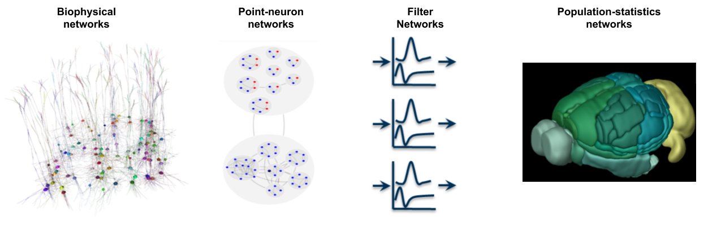
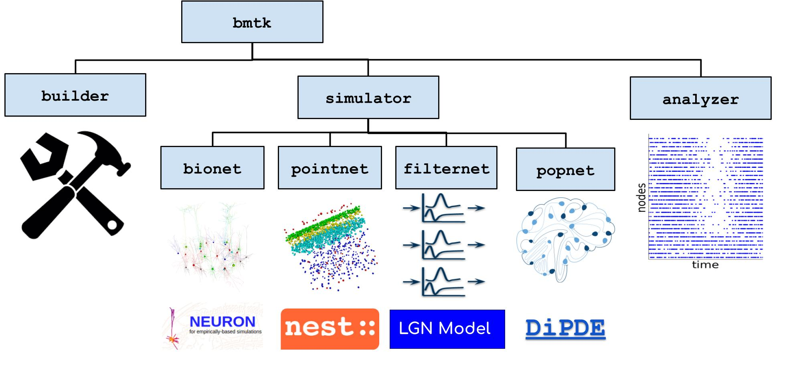

.. Brain Modeling Toolkit documentation master file, created by
   sphinx-quickstart on Tue Sep 26 10:33:33 2017.
   You can adapt this file completely to your liking, but it should at least
   contain the root `toctree` directive.

Welcome to the Brain Modeling Toolkit
=====================================

.. toctree::
   :maxdepth: 2
   :titlesonly:
   :hidden:

   Installation Guide <installation>
   Building Networks <builder>
   simulators
   analyzer
   Tutorials <https://github.com/AllenInstitute/bmtk/blob/develop/docs/tutorial/00_introduction.ipynb>
   Github Profile <https://github.com/AllenInstitute/bmtk.git>
   contributors
   Source Documentation <bmtk/bmtk>

The Brain Modeling Toolkit (BMTK) is a python-based software package for building, simulating and analyzing large-scale
neural network models. It supports the building and simulation of models of varying levels-of-resolution; from
multi-compartment biophysically detailed networks, to point-neuron models, to filter-based models, and even
population-level firing rate models.

The BMTK is not itself a simulator and will utilize existing simulators, like NEURON and NEST, to run different types of
models. What BMTK does provide:

* A unified inteferce across different simulators, so that modelers can work with and study their own network models
  across different simulators without having to learn how to use each tool.
* An easy way to setup and initialize network simulations with little-to-no programming necessacary
* Automatic integration of parallelization when running on HPC.
* Extra built-in features which the native simulators may not support out-of-the-box.

The BMTK was developed and is supported at the `Allen Institute for Brain Science <https://alleninstitute.org/>`_ and
released under a BSD 3-clause license. We encourage others to use the BMTK for their own research, and suggestions and
contributions to the BMTK are welcome.

The latest release, previous releases, and current development can be found at::

  https://github.com/AllenInstitute/bmtk

The BMTK Workflow and architecture
----------------------------------
BMTK can readily scale to run models of single neurons, and even single compartments, and for all different types of
neuronal networks. However BMTK was designed for very-large, highly optimized mammalian cortical network models.
Generating the connectivity matrix could take hours or even days to complete. Plus once we had the base-line model we
wanted to run against a large variety of conditions and stimuli, so that we could directly compare with existing in-vivo
recordings (see Allen Brain Observatory).

.. figure:: _static/images/bmtk_workflow.jpg
   :scale: 100%

Unlike other simulators, BMTK separates the process of building, simulating, and analyzing the results. First a fully
instantiated base-line version of the model is built and saved to a file so each time a simulation is ran it takes only
a small fraction of the time to instantiate the simulation. Results are also automatically saved to a disk. BMTK and
the format it uses [SONATA, see below] makes it easy to dynamically adjust cell and synaptic parameters so that multiple
iterations of a simulation be done as fast as possible

As such BMTK can be broken into three major components:

* The Network Builder [``bmtk.builder``] - Used to build network models
* The Simulation Engines [``bmtk.simulator``] - Interfaces for simulating the network
* Analysis and Visualization Tools [``bmtk.analyzer``] - Python functions for analyzing and visualizing the network and simulation results

The components can be as one workflow or separately by themselves. BMTK utilizes the SONATA Dataformat (See next section)
to allow sharing of large-scale network data. As such, it is possible to use the Network Builder to build the model but
another tool to run the model. Or if another model has been built by someone else and saved in SONATA format BMTK will
be able to simulate it.

SONATA
------
SONATA is a multi-institutional developed standardized, cross-platform data format for storing large scale networks and
simulation results. The BMTK utilizes SONATA when building and simulating networks, so much of what is being described
in the documentation and tutorials will be based on SONATA. For more information see the `SONATA github page <https://github.com/AllenInstitute/sonata>`_.

Acknowledgements
----------------
We wish to thank the Allen Institute for Brain Science founder, Paul G. Allen, for their vision, encouragement, and support.
