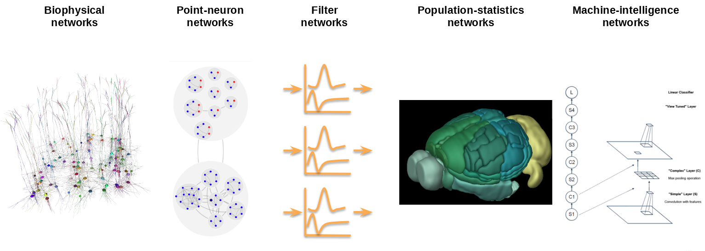
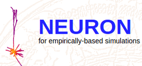
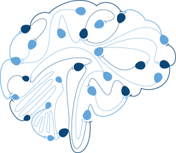
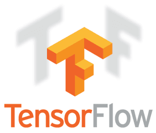

.. Brain Modeling Toolkit documentation master file, created by
   sphinx-quickstart on Tue Sep 26 10:33:33 2017.
   You can adapt this file completely to your liking, but it should at least
   contain the root `toctree` directive.

Welcome to the Brain Modeling Toolkit
=====================================

.. toctree::
   :maxdepth: 2
   :titlesonly:
   :hidden:

   Installation Guide <installation>
   Building Networks <builder>
   simulators
   Tutorials <https://github.com/AllenInstitute/bmtk/blob/develop/docs/tutorial/00_introduction.ipynb>
   Github Profile <https://github.com/AllenInstitute/bmtk.git>
   Source Documentation <bmtk/bmtk>

The Brain Modeling Toolkit (bmtk) is a  python-base software package for creating and simulating large-scale brain
models. It supports building, simulation and analysis of models of different levels of resolution including:

* Biophysically detailed networks.
* Point neuron networks.
* Filter models.
* Population-level networks.
* Machine-learning networks.

The bmtk was developed and is supported at the `Allen Institute for Brain Science <https://alleninstitute.org/>`_ and
released under a BSD 3-clause license. We encourage others to use the bmtk for their own research, and suggestions and
contributions to the bmtk are welcome.

The latest release, previous releases, and current development can be found at::

  https://github.com/AllenInstitute/bmtk

Requirements
============
The bmtk runs on Python 2.7 and 3.6+. To use the base features, including building and analyzing networks, require the
following numpy packages. When installing using anaconda, pypi or distutils these dependencies will be installed if
not already:

* `numpy <http://www.numpy.org/>`_
* `h5py <http://www.h5py.org/>`_
* `pandas <http://pandas.pydata.org/>`_
* `matplotlib <https://matplotlib.org/>`_
* `jsonschema <https://pypi.python.org/pypi/jsonschema>`_

Optional dependencies:
* `mpi4py <https://mpi4py.readthedocs.io/en/stable/>`_
* `pytest <https://docs.pytest.org/en/latest/>`_

For running network simulations bmtk uses existing software, which will differ depending on the type of simulation. As such
there may be additional requirements.

  |neuron_icon| Biophysically detailed simulation with BioNet uses the `NEURON simulator (7.4+) <https://www.neuron.yale.edu/neuron/>`_

  |nest_icon| Point simulations with PointNet uses the `NEST simulator (2.11+) <http://www.nest-simulator.org/>`_

  |dipde_icon| Population level firing rates simulation with PopNet uses `DiPDE <http://alleninstitute.github.io/dipde/>`_

  |tensorflow_icon| Machine-learning models with MintNet uses `TensorFlow <https://www.tensorflow.org/>`_

See Installation page and individual simulator pages for further instructions.

Additonal Resources
===================

**Tutorials** - Jupyter-notebook tutorials for using the bmtk can be found at https://github.com/AllenInstitute/bmtk/blob/develop/docs/tutorial/00_introduction.ipynb.

**Examples** - A collection of examples for building and running simulations across different levels of resolution can be found at https://github.com/AllenInstitute/bmtk/tree/develop/docs/examples.

**Questions** - Any bugs, questions, or feature requests can be done from our github issue page at https://github.com/AllenInstitute/bmtk/issues.
Or please feel free to contact Anton Arkhipov (antona at alleninstitute dot org) and Kael Dai (kaeld at alleninstitute dot org) regarding any questions

Papers and Posters
==================
* Paper about bmtk's BioNet simulator can be found on `PLOS ONE <https://journals.plos.org/plosone/article?id=10.1371/journal.pone.0201630>`_

SONATA Data Format
==================
The SONATA data format was developed jointly by the Allen Institute and the Blue Brain Project as a standarized,
cross-platform format for storing large scale networks and simulation results. The bmtk utilizes when building and
simulating networks. Not only does this improve performance and file size, but it lets the bmtk interact with the growing
list of software that supports the SONATA format.

More information about the SONATA (and hence bmtk) data format can be found at the `SONATA github page <https://github.com/AllenInstitute/sonata>`_

Contributors
============
Sergey Gratiy, Yazan Billeh, Kael Dai, Nicholas Cain, Ram Iyer, Fahimeh Baftizadeh, Jung Hoon Lee, Nathan Gouwens, Yina Wei,
Catalin Mitelut, Richard Xu, David Feng, Michael Buice, Stefan Mihalas, and Anton Arkhipov

We wish to thank the Allen Institute for Brain Science Founders, Paul G. Allen and Jody Allen, for their vision, encouragement, and support.
