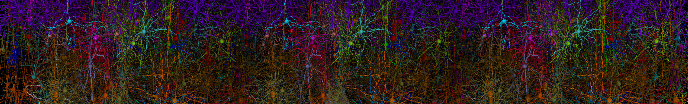

################################
BMTK: The Brain Modeling Toolkit
################################

.. toctree::
   :hidden:

   About BMTK <self>
   news_and_events
   contact_us
   installation
   user_guide
   tutorials
   developers_guide

About BMTK
==========

.. card::

   The Brain Modeling Toolkit (BMTK) is a open-source software package for modeling and simulation of large-scale, 
   realistic neural network models. It's designed to support a range of different levels-of-resolution; from 
   multi-compartment biophysically detailed cells, point-neuron, filter-based models, and even population-level 
   firing-rate models. 
   
   .. raw:: html

      

         
      

   BMTK isn't just a simulation tool, but is designed to support the full workflow that would be required for developing 
   realistic models of the brain; from building network models from scratch, to using running existing models with novel 
   conditions, to doing pertubraiton analysis and parameter searching before an experiment. 

   .. grid:: 2

      .. grid-item:: 

         * An API for building instantiable models that can encorporate exitings cell and connectivity data.
         
         * Provides a framework to easily share models and allow for scientist to expand upon existing models and simulations.
         
         * Quickly set-up and run a variety of simulations on built or borrowed models under varying conditions

           * Create your own variety of network input stimuli or import experimental data.
          
           * Simulate recording from a variety of different modalities.

           * Combine multple networks into one simulation, or silence subsets of an existing network.

           * Run multiple simulations in parallel or serial for parameter optimization.
         
         * A suite of funtions for analyzing and visualizing network structure and simulations results.
            
         * Programatically adjust cell and synaptic properties on-the-fly during simulations. 

   
      .. grid-item::

         .. figure:: _static/images/modeling_lifecycle.png
            :scale: 50%

   BMTK is written in Python, but also through the use of the SONATA JSON format, users can easily set-up, run, modify, and 
   re-run multiple network simulations under a variety of different conditions and perturbations without having to write a 
   single line of code. While at the same time BMTK is powerful and adaptable to allow more advance users to completely 
   change how networks are instantiated and simulated.

   
   BMTK can run network models ranging from the simplest model of a single cell, to networks with millions of cells 
   and billions of synapses. As such BMTK can automatical scale networks to run as effiecent as possible on everything
   from single core laptops to high performance computing clusters running thousand of cores. 
   
   .. figure:: _static/images/bmtk_compute_scaling.png
      :scale: 80%

Further Resources
=================

.. grid:: 1 1 2 2
   :gutter: 1

   .. grid-item-card:: `Publications <publications.html>`__
      :columns: 12

      For further detail about BMTK please see our paper in `PLOS Computational Biology <https://journals.plos.org/ploscompbiol/article?id=10.1371/journal.pcbi.1008386>`__.

         [1] Dai, K., Gratiy, S. L., Billeh, Y. N., Xu, R., Cai, B., Cain, N., Rimehaug, A. E., Stasik, A. J., Einevoll, G. T., Mihalas, S., Koch, C., & Arkhipov, A. (2020). Brain Modeling ToolKit: An open source software suite for multiscale modeling of brain circuits. PLoS Computational Biology, 16(11), e1008386. https://doi.org/10.1371/journal.pcbi.1008386 

      *bibtex*
      
      .. code:: latex

         @article{dai2020brain,
            title={Brain Modeling ToolKit: An open source software suite for multiscale modeling of brain circuits},
            author={Dai, Kael and Gratiy, Sergey L and Billeh, Yazan N and Xu, Richard and Cai, Binghuang and Cain, Nicholas and Rimehaug, Atle E and Stasik, Alexander J and Einevoll, Gaute T and Mihalas, Stefan and others},
            journal={PLOS Computational Biology},
            volume={16},
            number={11},
            pages={e1008386},
            year={2020},
            publisher={Public Library of Science San Francisco, CA USA}
         }
      
      We also have a `publications <publications.html>`_ page for a list of other relevant articles about BMTK or that have utilized BMTK in their own work.

   .. grid-item-card:: `User Guide <user_guide.html>`_

      For detailed usage about using BMTK and all the available features please see our `User Guide <user_guide>`_ page.

   .. grid-item-card:: `Tutorials and Examples <tutorials.html>`_

      For a list of workable tutorials and example networks please see our `Tutorials and Examples <tutorials.html>`_ page.      

   .. grid-item-card:: Allen Brain Map Portal

      For examples of how we use BMTK and related tools to build realistic models at the Allen Institute, please see our  `Computational Modeling & Theory page at the Allen Brain Map Portal <https://portal.brain-map.org/explore/models>`__.

   .. grid-item-card:: `Contact Us <contact_us.html>`__ 

      If you have questions, issues, or requests for BMTK developers and/or the scientists that use the tool in their 
      own modeling work, please feel free to reach out to us directly. Our `Contact Us <contact_us.html>`__ page contains 
      a number of ways to reach out to our team at the Allen Institute.

Related Tools
-------------

.. grid:: 1

   .. grid-item-card:: SONATA Data Formats

      SONATA is a multi-institutional developed standardized, cross-platform data format for storing large scale networks and
      simulation results. The BMTK utilizes SONATA when building and simulating networks, so much of what is being described
      in the documentation and tutorials will be based on SONATA. For more information see the
      `SONATA github page <https://github.com/AllenInstitute/sonata>`_.

   .. grid-item-card:: Visual Neuronal Dynamics (VND)

      `Visual Neuronal Dynamics <https://www.ks.uiuc.edu/Research/vnd/>`_ is a software package for 3D visualization of neuronal network models. VND can be used to check and inspect models, such as those created by BMTK, as well as to visualize the activity output. Images and movies made in VND can also be used to showcase or schematize models for presentations and publications. VND is developed in a collaboration between researchers at the University of Illinois at Urbana-Champaign and Allen Institute.  

Acknowledgements
================

.. card:: 

   We wish to thank the Allen Institute for Brain Science founder, Paul G. Allen, for their vision, encouragement, and support.

