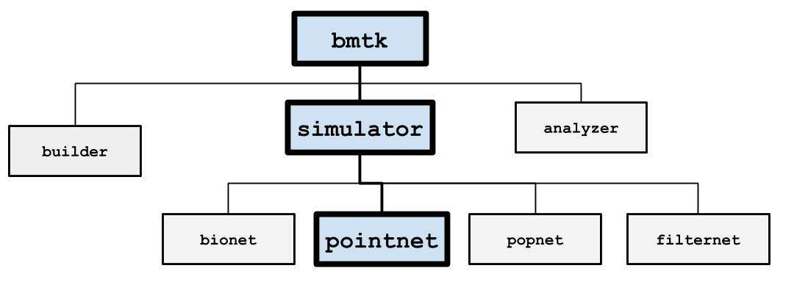

PointNet
========

PointNet is a simulation engine that utilizes `NEST <http://www.nest-simulator.org/>`_ to run large-scale point
neuron network models. Features including:

* Run the same simulation on a single core or in parallel on an HPC cluster with no extra programming required.
* Supports any spiking neuron models (rates models in development) available in NEST or with user contributed modules.
* Records neuron spiking, multi-meter recorded variables into the optimized SONATA data format.

Inputs
------
Inputs can be specified in the "inputs" sections of the `simulation config <simulators.html#configuration-files>`_,
following the rules specified in the
`SONATA Data format <https://github.com/AllenInstitute/sonata/blob/master/docs/SONATA_DEVELOPER_GUIDE.md#simulation-input---stimuli>`_.

Spike-Trains
++++++++++++
Cells with ``model_type`` value ``virtual`` are equivalent to NEST’s spike_generator models which will play a
pre-recorded series of spikes throughout the simulation. You may use either a
`SONATA spike-train file <./analyzer.html#spike-trains>`_, an NWB file, or a space-separated csv file with columns
**node_id**, **population**, and **timestamps**. Examples of how to create your own spike-train files can be found
`here <./analyzer.html#creating-spike-trains>`_.

.. code:: json

    {
        "LGN_spikes": {
            "input_type": "spikes",
            "module": "sonata",
            "input_file": "./inputs/lgn_spikes.h5",
            "node_set": {"population": "lgn"}
        }
    }

* module:  either sonata, hdf5, csv, or nwb: depending on the format of the spikes file
* `node_set <./simulators.html#node-sets>`_: used to filter which cells will receive the inputs
* input_file: path to file contain spike-trains for one or mode node

Current-Clamps
++++++++++++++
May use one step current clamp on multiple nodes, or have one node receive multiple current injections.

.. code:: json

    {
        "current_clamp_1": {
            "input_type": "current_clamp",
            "module": "IClamp",
            "node_set": "biophys_cells",
            "amp": 0.1500,
            "delay": 500.0,
            "duration": 500.0
        }
    }

* module:  Always IClamp
* `node_set <./simulators.html#node-sets>`_: used to filter which cells will receive the inputs
* amp: injection in pA
* delay: onset of current injection in ms
* duration: duration of current injection in ms

Outputs
-------

Spikes
++++++
By default all non-virtual cells in the circuit will have all their spikes at the soma recorded.

Membrane and Intracellular Variables
++++++++++++++++++++++++++++++++++++
Used to record the time trace of specific cell variables, usually the membrane potential (v). This is equivalent to NEST’s multimeter object.

.. code:: json

    {
        "membrane_potential": {
            "module": "multimeter_report",
            "cells": {"population": "V1"},
            "variable_name": "V_m"
            "file_name": "cai_traces.h5"
        }
    }

* module: either mutlimeter_report or membrane_report, both the same
* variable_name: name of variable being recorded, will depend on the nest cell model.
* cells: a `node_set <./simulators.html#node-sets>`_ filter out what cells to record.
* file_name: name of file where traces will be recorded, under the “output_dir”. If not specified the the report title
   will be used, eg “calcium_concentration.h5” and “membrane_potential.h5”
