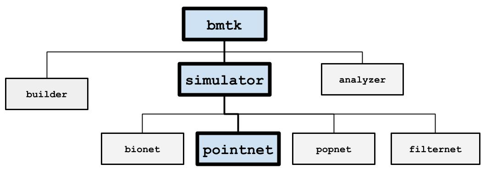

PointNet
========

PointNet is a simulation engine that utilizes `NEST <http://www.nest-simulator.org/>`_ to run large-scale point
neuron network models. Features include:

* Ability to run the same simulation on a single core or in parallel with no extra programming required
* Support for any spiking neuron model available in NEST or with user contributed modules
* Recording of neuron spike times and multi-meter variables in the optimized SONATA data format

To build a network in PointNet, please see the `Network Builder overview <https://alleninstitute.github.io/bmtk/builder.html>`_.

For an example tutorial, please see `Tutorial 5: Point-Neuron Network Models <https://alleninstitute.github.io/bmtk/tutorials/tutorial_05_pointnet_modeling.html>`_.

For an example network with 12,500 randomly connected excitatory and inhibitory point neurons, please see the `BMTK github <https://github.com/AllenInstitute/bmtk/tree/develop/examples/ei_networks>`_.

Inputs
------
Inputs can be specified in the "inputs" sections of the `simulation config <simulators.html#configuration-files>`_,
following the rules specified in the
`SONATA Data format <https://github.com/AllenInstitute/sonata/blob/master/docs/SONATA_DEVELOPER_GUIDE.md#simulation-input---stimuli>`_.

Spike-Trains
++++++++++++

Cells with `model_type` value `virtual` are equivalent to NEST's `spike_generator <https://nest-simulator.readthedocs.io/en/v3.7/models/spike_generator.html>`_ model
which plays a pre-recorded series of spikes throughout the simulation. You may use either a
`SONATA spike-train file <./analyzer.html#spike-trains>`_, an NWB file, or a space-separated csv file with columns
**node_id**, **population**, and **timestamps**. Examples of how to create your own spike-train files can be found
`here <./analyzer.html#creating-spike-trains>`_.

.. code:: json

    {
        "LGN_spikes": {
            "input_type": "spikes",
            "module": "sonata",
            "input_file": "./inputs/lgn_spikes.h5",
            "node_set": {"population": "lgn"}
        }
    }

* module:  either sonata, hdf5, csv, or nwb: depending on the format of the spikes file
* `node_set <./simulators.html#node-sets>`_: used to filter which cells will receive the inputs
* input_file: path to file contain spike-trains for one or mode node

`Extracelluar ElectroPhysiology (ECEPhys) Probe Data (NWB 2.0) Spikes <ecephys_probe.html>`_
++++++++++++++++++++++++++++++++++++++++++++++++++++++++++++++++++++++++++++++++++++++++++++

An increasing number of ECEPhys electrode experimental data are available to the public in NWB format, such as the 
`Allen Visual Coding - Neuropixels <https://allensdk.readthedocs.io/en/latest/visual_coding_neuropixels.html>`_ dataset or the many datasets available on
`DANDI <https://dandiarchive.org/>`_. While it is possible to manually convert this data into SONATA spike-trains to 
encorpate into your simulations, the `ecephys_probe` spikes module can do this automatically; fetching spikes from ECEPhys units
and converting them to virtual cells for network input into your model.

For example, using a session NWB downloaded using the AllenSDK, the below example wil randomly map "LGd" cells from the session onto our
"LGN" population, and filter out only spikes that occur between 10.0 and 12.0 seconds:

.. code:: json

    {
      "inputs": {
        "LGN_spikes": {
          "input_type": "spikes",
          "module": "ecephys_probe",
          "input_file": "./session_715093703.nwb",
          "node_set": {"population": "LGN"},
          "mapping": "sample_with_replacement",
          "units": {
            "location": "LGd"
          },
          "interval": [10000.0, 12000.0]
        }
      }
    }

See the `documentation <ecephys_probe.html>`__ for more information and advanced features.

`Current Clamps <current_clamps.html>`_
+++++++++++++++++++++++++++++++++++++++
May use one step current clamp on multiple nodes, or multiple current injections to a single node.

.. code:: json

    {
        "current_clamp_1": {
            "input_type": "current_clamp",
            "module": "IClamp",
            "node_set": "biophys_cells",
            "amp": 0.1500,
            "delay": 500.0,
            "duration": 500.0
        }
    }

See `documentation <current_clamps.html>`__ for more details on using current clamp inputs.

Outputs
-------

Spikes
++++++
By default all non-virtual cells in the circuit will have all their spikes recorded as if from the soma.

Membrane and Intracellular Variables
++++++++++++++++++++++++++++++++++++
Used to record the time trace of specific cell variables, usually the membrane potential (v). This is equivalent to NEST’s `multimeter object <https://nest-simulator.readthedocs.io/en/v3.3/models/multimeter.html>`_.

.. code:: json

    {
        "membrane_potential": {
            "module": "multimeter_report",
            "cells": {"population": "V1"},
            "variable_name": "V_m"
            "file_name": "cai_traces.h5"
        }
    }

* module: either multimeter_report or membrane_report, both the same
* variable_name: name of the variable being recorded, will depend on the NEST cell model
* cells: a `node_set <./simulators.html#node-sets>`_ defines what cells to record
* file_name: name of the data file, under the “output_dir”. If not specified the the report title
   will be used, eg “calcium_concentration.h5” and “membrane_potential.h5”

Recording Synaptic Weights
++++++++++++++++++++++++++
Used to record the synaptic weight changes throughout the simulation lifetime. This tool is useful for measuring changes in plastic synapse models like 
"stdp_synapse" or "tsodyks_synapses" (can also be used for static synapses though values will never change). To create a recorder, add the following 
section to the "reports" section in the simulation config json:

.. code:: json

    {
        "reports": {
            "<name>": {
                "module": "weight_recorder",
                "nest_model": "<original-nest-model>",
                "model_template": "<recorder-name>",
                "file_name": "<file-name>.csv"
            }
        }
    }

which will create a special synapse model called "<recorder-name>", which is just a version of *<original-nest-model>* that will save a trace
of the synaptic changes to the csv file *output/<file-name>.csv*. Just set the **model_template** property value to "<recorder-name>" in the edge-types file.

For example, to record the changes to a subset of the *stdp_synapse* type NEST models, add the following to the configuration:

.. code:: json

    {
        "reports": {
            "weight_recorder_stdp_1": {
                "module": "weight_recorder",
                "nest_model": "stdp_synapse",
                "model_template": "stdp_synapse_recorder",
                "file_name": "stdp_weights.csv",
            }
        }
    }

Then make the following changes to the **edge_types.csv** file

.. list-table:: 
   :widths: 25 25 25 25
   :header-rows: 1

   * - edge_type_id
     - model_template
     - dynamics_params
     - ...
   * - 100
     - stdp_synapse_recorder
     - stdp_params.json
     - ...
