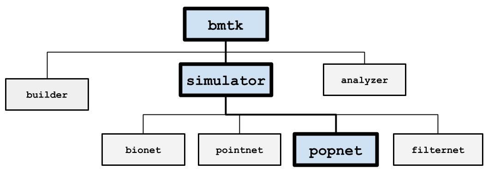

PopNet
======

The PopNet simulation engine uses the `DiPDE simulator <http://alleninstitute.github.io/dipde/>`_ to simulate firing
rate dynamics of connected population of cells. You can use networks of populations "nodes", or take an existing
network of individual cell models and PopNet will cluster them into populations.

Installation
------------
PopNet supports both Python 2.7 or Python 3.6+, and also requires DiPDE to be installed. See our
`Installation instructions <installation>`_ for help on installing DiPDE and the BMTK.

Documentation and Tutorials
---------------------------
Our `github page <https://github.com/AllenInstitute/bmtk/tree/develop/docs/tutorial>`__ contains a number of jupyter-notebook
tutorials for using the BMTK in general and PopNet specific examples for:
* `Building a simple two population model <https://github.com/AllenInstitute/bmtk/blob/develop/docs/tutorial/06_population_modeling.ipynb>`_.

About DiPDE
++++++++++++
DiPDE was developed at the Allen Institute for Brain Science for population level modeling of the mammallian cortex. For
a list of the available features please see the `DiPDE documentation <http://alleninstitute.github.io/dipde/index.html>`_.

For further questions about DiPDE please contact Nicholas Cain (nicholasc at alleninstitute dot org)

Previous Materials
++++++++++++++++++
The following are from previous tutorials, workshops, and presentations; and may not work with the latest version of the BMTK.
* CNS 2018 Workshop: `notebooks <https://github.com/AllenInstitute/CNS_2018_Tutorial/tree/master/bmtk>`__
* Summer Workshop on the Dynamic Brain 2018: `notebooks <https://github.com/AllenInstitute/SWDB_2018/tree/master/DynamicBrain/Modeling>`__.

Examples
--------
The AllenInstitute/bmtk repo contains a number of PopNet examples, many with pre-built networks and can be immediately ran. These
tutorials will have the folder prefix *pop_* and to run them in the command-line simply call::

  $ python run_popnet.py config.json

Current examples
++++++++++++++++
* `pop_2pop <https://github.com/AllenInstitute/bmtk/tree/develop/examples/pop_2pops>`_ - A simple recurrently connected network with one excitatory and one inhibitory population.
* `pop_7pops_converted <https://github.com/AllenInstitute/bmtk/tree/develop/examples/pop_7pops_converted>`_ - A conversion our a mouse cortex L4 spiking network into a population rates network.

