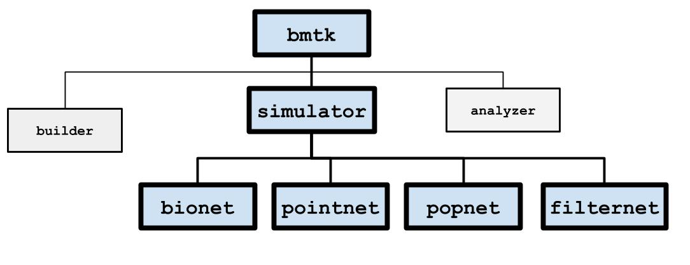
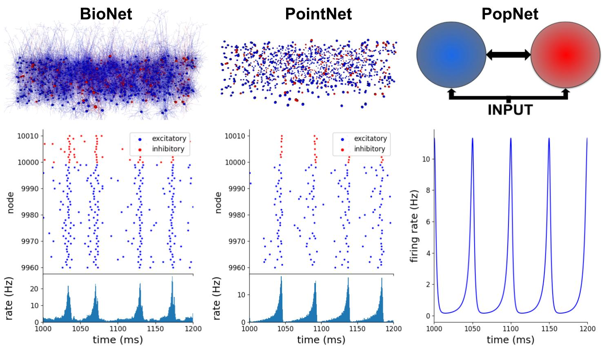
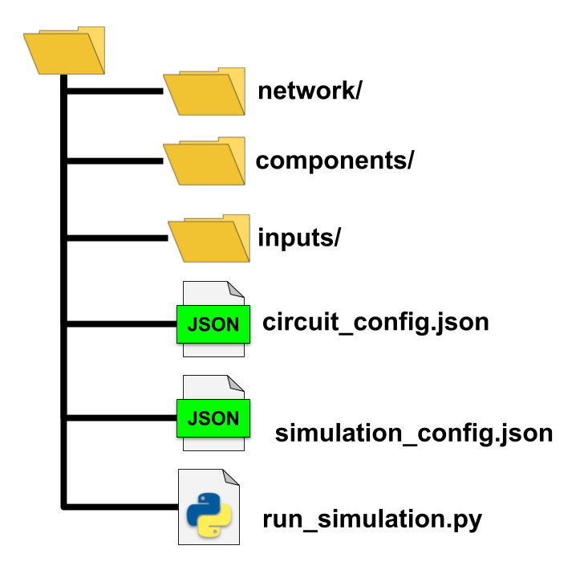

Simulation Engines
==================
.. toctree::
   :maxdepth: 2
   :titlesonly:
   :hidden:

   bionet
   pointnet
   popnet
   filternet

The :py:mod:`bmtk.simulator` module contains classes for simulating a network under a variety of different simulators.
BMTK doesn't actually do the simulation itself, but processes the inputs and passes it off to an existing engine. At the
moment there are four different simulation engines for running a network at different levels-of-resolution:

* `BioNet <./bionet>`_ - Uses `NEURON <https://neuron.yale.edu>`_ to run biophysically realistic models
* `PointNet <./pointnet>`_ - Uses `NEST <https://www.nest-simulator.org/>`_ to run point-neuron based models
* `PopNet <./popnet>`_ - Uses `DiPDE <https://github.com/AllenInstitute/dipde>`_ to run population-based firing rate models.
* `FilterNet <./filternet>`_ - Uses Filter based units, that uses a liner-nonlinear-poisson cascading models, base on the
   mammalian LGN, to convert inputs into spikes.

usually capture a neuron's membrane potential trace (when the model_template supports it) that doesn’t isn't possible on
a population or filter-based level of resolution. And specific dynamics may occur at one level and not another. Thus it
is important for the modeler to choose what levels they use. However running simulations across the different engines is
done in the same way. The following sections provide a high level overview of how to set up and run network simulations
across all the engines. Functionality that is unique to a specific engine is covered more in-depth in the documentation
for that engine.

In most cases running a simulation doesn’t require any programming - and at most just the ability to execute a
command-line script. The process for setting up and running a simulation usually involves three steps

1. Setting up the environment, a folder with the necessary files and scripts.

2. Modifying the configuration files with a text-editor

3. Executing the simulation

The Simulation Environment
--------------------------
The standard BMTK directory structure for running one or more simulations will typically have all the necessary files
contained within their own directory as such:

* **network/** - directory containing the SONATA Network files, either built using the `NetworkBuilder <./builder.html>`_
   or provided to us from another source.

* **components/** - Will usually contain neuron and synaptic parameter files, morphologies, NEURON hoc mechanisms.
   In general files, external files used to instantiate the nodes and edges of the network.

* **inputs/** - Often contain spike-trains, movies, images and other stimuli to drive our network. Not always required.

* **circuit_config.json** - configuration file containing information for instantiating the network.

* **simulation_config.json** - configuration file with information on how to run the simulation, including the input
   and output of the simulation.

* **run_simulation.py** - a python script that will actually run the simulation.

The names of the files and folders can be changed as the modeler desires. Nor is it required or always beneficial that
everything be contained within the same directory. For example different networks may share the same neuron/synaptic
component files, thus it would make sense to move the *components* directory to a location that can be accessed by
all simulations. As described below the location of the directories and files are specified in the configuration files.

Creating the environment
++++++++++++++++++++++++
A good way to create a working simulation directory is to copy an existing one and make modifications as needed. The
`BMTK <https://github.com/AllenInstitute/bmtk>`_ and `SONATA <https://github.com/AllenInstitute/sonata>`_ github page
contains multiple examples.

BMTK also contains a script :py:func:`bmtk.utils.sim_setup` that will automatically create a base-line simulation
environment for you. To create the directory structure for a BioNet simulation called my_sim, including the necessary
config and run scripts, run the following in the command-line:

.. code:: bash

   $ python -m bmtk.utils.sim_setup bionet my_sim

You may also replace **bionet** with either **pointnet**, **popnet**, or **filternet**. Once it *my_sim/* directory has
been created the modeler will need to move the necessary network, components, and input files to their correct place. Then
modify the configuration, using a text editor, as required. And finally the network can be run. See below.

The sim_setup script also contains many extra options, see the help menu for full list:

.. code:: bash

   $ python -m bmtk.utils.sim_setup -h

Configuration Files
-------------------
Under most circumstances setting up and/or modifying a simulation involves adding and altering values within the JSON
configuration files. The SONATA standard specifies two configuration files; a circuit_config.json containing information
about the network and component files. And a simulation_config.json used for actually running the full circuit. BMTK
allows modelers to combine the two configs into one (but other SONATA support software may not).

The following breaks down the different sections found in the SONATA configs. See the
`SONATA documentation <https://github.com/AllenInstitute/sonata/blob/master/docs/SONATA_DEVELOPER_GUIDE.md>`_ for
more details. Some simulation engines may allow for additional options that will be described in their respective docs.

manifest
++++++++
The “manifest” section is optional and allows modelers to define aliases within the config, which are signified by the
dollar-sign like shell variables; eg ``$VARNAME`` or ``${VARNAME}``. For example if the manifest contains the following:

.. code:: json

   {
      "manifest": {
         "$COMP_DIR": "/home/ahodgkin/workspace/shared/bionet/components":
      },

      "components": {
         "morphologies_dir": "$COMP_DIR/morphologies",
         "synaptic_models_dir": "$COMP_DIR/synaptic_models"
      }
   }

networks
++++++++
contains locations of the node and edges files used to build the circuit, such that multiple node and edge files may be
combined into one circuit. For example the following contains V1 network, with their recurrent connections
(v1_v1_edges\*) plus input from LGN nodes (lgn_v1_edges\*)

.. code:: json

   {
      "networks": {
         "nodes": [
         {
            "nodes_file": "$NETWORK_DIR/v1_nodes.h5",
            "node_types_file": "$NETWORK_DIR/v1_node_types.csv"
         },
         {
            "nodes_file": "$NETWORK_DIR/lgn_nodes.h5",
            "node_types_file": "$NETWORK_DIR/lgn_node_types.csv"
         }
         ],
         "edges": [
         {
            "edges_file": "$NETWORK_DIR/v1_v1_edges.h5",
            "edge_types_file": "$NETWORK_DIR/v1_v1_edge_types.csv"
         },
         {
            "edges_file": "$NETWORK_DIR/lgn_v1_edges.h5",
            "edge_types_file": "$NETWORK_DIR/lgn_v1_edge_types.csv"
         }
         ]
      }
   }

Changing the network can be done by removing or adding nodes or edges. BMTK also has the “enabled” option (not a part
of SONATA)

.. code:: json

   {
      "edges_file": "$NETWORK_DIR/lgn_v1_edges.h5",
      "edge_types_file": "$NETWORK_DIR/lgn_v1_edge_types.csv",
      "enabled": false
   }

components
++++++++++
links to external directories and files required to fully instantiate all the models and parameters of the network,
see `SONATA circuit config documentation <https://github.com/AllenInstitute/sonata/blob/master/docs/SONATA_DEVELOPER_GUIDE.md#tying-it-all-together---the-networkcircuit-config-file>`_
for a full description

.. code:: json

   {
      "components": {
         "morphologies_dir": "./components/morphologies",
         "synaptic_models_dir": "./components/synaptic_models",
         "mechanisms_dir":"./components/mechanisms",
         "point_neuron_models_dir": "./components/point_neuron_models_dir"
      }
   }

run
+++
contains simulation parameters. most importantly are

* tstart: simulation start time in ms (default 0.0)
* stop: final simulation time in ms
* dt: time step parameter
* overwrite_output_dir: overwrites any previous ran results

.. code:: json

   {
      "run": {
         "tstop": 3000.0,
         "dt": 0.1,
         "overwrite_output_dir": true
      }
   }

output
++++++
Sections contain general information about where to output the results on the simulation. When the simulation starts
the output_dir will be automatically created (and will overwrite existing output if overwrite_output_dir is true) as
well as the log_file. By default BMTK will always record and save the spikes of all the nodes of the simulation
(see "reports" section for how to change this) into the "spikes_file".

.. code:: json

   {
      "output":{
         "output_dir": "./output",
         "log_file": "log.txt",
         "spikes_file": "spikes.h5",
         "spikes_sort_order": "time"
      }
   }

inputs
++++++
Contains different inputs that will drive the simulation. In BioNet and PointNet usually the inputs involves either
spike trains injected into the network using external **virtual** nodes, or the use of current clamps. The following
example does both:

.. code:: json

   {
      "inputs": {
         "virtual_spikes": {
            "input_type": "spikes",
            "module": "h5",
            "node_set": {"population": "LGN"},
            "input_file": "$INPUT_DIR/lgn_spikes.h5"
         },
         "current_clamp": {
            "input_type": "current_clamp",
            "module": "IClamp",
            "node_set": {"node_ids": [10, 20, 30, 100]},
            "amp": 0.1500,
            "delay": 500.0,
            "duration": 500.0
         }
      }
   }

The ``input_type`` and ``module`` parameters for each input describes the method and type of input. The ``node_set``,
described below, filters the cells for which the stimulus will be applied too. Other types of stimuli are specific to
only certain engines; like extracellular potentiation in BioNet or movies in FilterNet.

reports
+++++++
Contains information about what variables will be recorded during the simulation. For example to record membrane
potential in all the biophysically detailed cells in the V1 population:

.. code:: json

   {
      "reports": {
         "membrane_potential": {
            "cells": {"population": "V1", "model_type": "biophysical"},
            "variable_name": "v",
            "module": "membrane_report",
            "file_name": "cell_vars.h5",
            "sections": "soma"
         }
      }
   }

By default BMTK will record the spike-trains of all non-virtual cells as specified in the ``outputs`` section, so it is not
necessary to create a ``"module": "spike_trians"`` report. But you may if, for example, you only want to record for
part of the full simulation time or record from a subset of all cells.

node_sets
+++++++++
`node_sets <https://github.com/AllenInstitute/sonata/blob/master/docs/SONATA_DEVELOPER_GUIDE.md#node-sets-file>`_
are filters for specific nodes within the circuit, mainly used to determine which cells to apply an "input" or a
"report". For example say we want to split the spike-train output of V1’s pvalb and pyramidal cells into different
reports

.. code:: json

   {
      "node_sets": {
         "pvalb_cells": {
            "population": "V1",
            "cell_type": "pvalb"
         },
         "pyr_cells":: {
            "population": "V1",
            "cell_type": "pyramidal"
         },
      },

      "reports": {
         "pvalb_spikes": {
            "cells": "pvalb_cells",
            "module": "spikes_report",
            "file_name": "pvalb_spikes.h5",
            "sort_by": "node_id"
         },
         "pyr_spikes": {
            "cells": "pyr_cells",
            "module": "spikes_report",
            "file_name": "pyr_spikes.h5",
            "sort_by": "node_id"
         }
      }
   }

``node_sets`` may also be a reference to an external json file.

If the node_set value is just a name, ie ``"cells": "V1"`` then it will automatically include cells in the “V1”
population. You may also reference individual nodes by their “node_id” - ``"cells": [0, 1, 2]``

Running a Simulation
--------------------
To run a simulation, open a command line and execute the run_<simulation>.py script:

.. code:: bash

   $ python run_simulation.py simulation_config.json

Output will be written to the “output_dir” as specified in the configuration, including a running log file.

For PointNet, PopNet, and FilterNet the simulations can be run using parallel cores using MPI with the following command:

.. code:: bash

   $ mpirun -np <N> python run_simulation.py simulation_config.json

For BioNet NEURON requires a slightly different way:

.. code:: bash

   $ mpirun -np <N> nrniv -mpi -python run_simulation.py simulation_config.json

