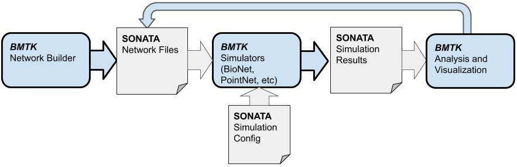
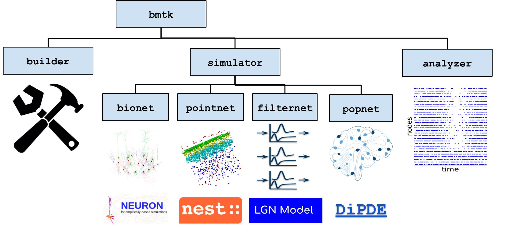

.. toctree::
    :hidden:
    :maxdepth: 3
    :caption: User Guide

    installation
    Overview of BMTK <self>
    builder
    simulators_guide
    analyzer
    tutorials

##########
User Guide
##########

******************************************
Overview of BMTK Workflow and Architecture
******************************************

.. _cards-clickable:

Getting Started
===============
.. grid:: 1 1 3 3
    :gutter: 1

    .. grid-item-card::  Building Networks
        :link: builder.rst
        :img-bottom: _static/images/builder_complete_network.jpg

        *NetworkBuilder* 

    .. grid-item-card:: Network Simulations
        :link: simulators_guide.rst
        :img-bottom: _static/images/brunel_comparisons.jpg

        *Setting up environments, BioNet, PointNet, PopNet* 

       
    .. grid-item-card:: Analyzing Networks and Simulations
        :link: analyzer.rst
        :img-bottom: _static/images/raster_120cells_orig.png

        *Plotting simulation results and statistics*      

Related Resources
=================

.. grid:: 1 1 3 3
    :gutter: 1

    .. grid-item-card:: Workshops and Tutorials
        :link: https://github.com/AllenInstitute/bmtk-workshop
        :img-bottom: _static/images/jupyter_notebook_generic.png

        *Link to workshops and other tutorials*

    .. grid-item-card:: Network and Simulation visualization
        :link: https://www.ks.uiuc.edu/Research/vnd/
        :img-bottom: _static/images/mousev1_vnd.png 

        *VND*

    .. grid-item-card:: The SONATA data format
        :link: https://github.com/AllenInstitute/sonata
        :img-bottom: _static/images/segmentation_indexing.jpg 

        *SONATA format guide and API*

    .. grid-item-card:: Allen Institute Mouse Models
        :link: https://portal.brain-map.org/explore/models
        :img-bottom: https://brainmapportal-live-4cc80a57cd6e400d854-f7fdcae.divio-media.net/filer_public/e3/fe/e3fedb92-d998-42c7-9799-3f19160cc2ca/computational-modeling-theory-140x140-72dpi.png

        *Link to brain-map portal*

Core Guides
===========