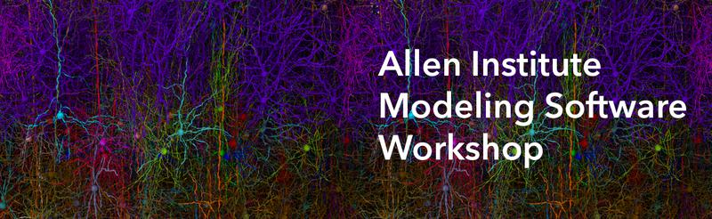

Annual Modeling Software Workshop
=================================

|
| The Allen Institute Modeling Software Workshop provides a hands-on opportunity to learn how to use open-source modeling tools 
| developed in part at the Allen Institute MindScope Program. 
|
| Topics covered include:
- Construction of heterogeneous models of brain circuits at a variety of resolutions
- Simple control and modification of simulation conditions 
- Use of realistic spiking or visual inputs
- Storage of model networks, inputs and outputs in a single shareable format
- Creation of beautiful visualizations for model verification, display and analysis

Thank you to the participants of our `inaugural workshop <https://alleninstitute.org/what-we-do/brain-science/events-training/2022-modeling-workshop/>`_ held on July 25 through July 26, 2022 at the Allen Institute!

The :download:`presentation <_static/2022-07-Allen-Institute-Software-Modeling-Workshop.pdf>` and `tutorials <https://github.com/AllenInstitute/bmtk_workshop_2022>`_ from the 2022 workshop are now publicly available. 

Stay tuned in early 2023 for opportunities to apply to our next round of the workshop! 

