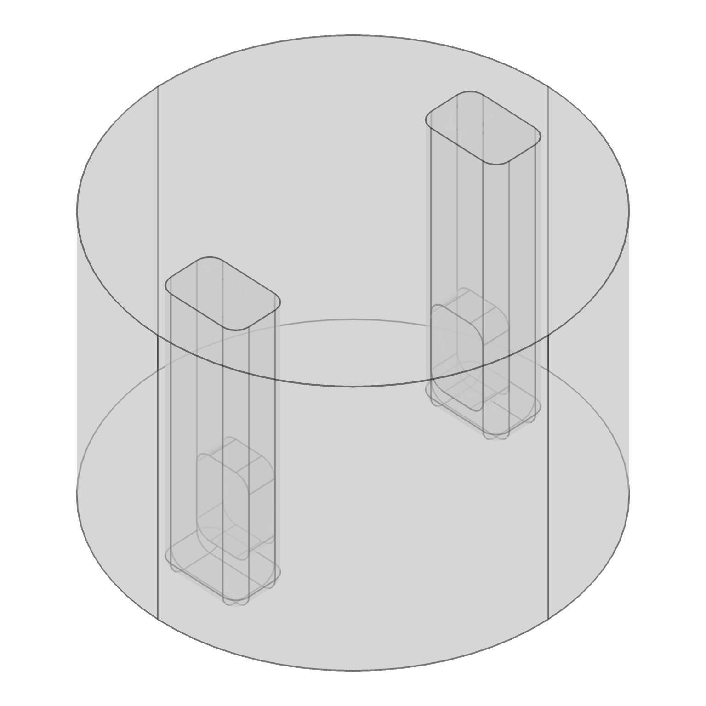
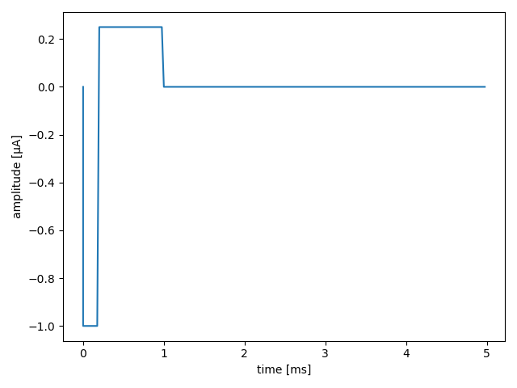

# COMSOL
This module takes extracellular potentials that were calculated in COMSOL and imposes them on a biophysically detailed network. 
It is similar to BioNet's xstim module, but offers the additional flexibility of FEM, instead of relying on simplified analytical solutions.
As such, this module allows to use BMTK as a part of the hybrid modelling approach, where extracellular potentials are calculated using FEM in a first step and then imposed on a model of a neuronal network in a second step.

This example consists of a network of 200 multi-compartment biophysically detailed cells placed in a column with a 75 µm radius and 100 µm height. 
The network receives input in the form of extracellular potentials defined by a .txt file that is exported from COMSOL. 

Uses the BioNet simulator (requires NEURON).


## Building:
The network files have already been built and stored as SONATA files in the *network/* directory. The bmtk Builder
script used to create the network files is *build_network.py*. To adjust the parameters and/or topology of the network
change this file and run:
```
$ python build_network.py
```
This will overwrite the existing files in the network directory. Note that there is some randomness in how the network
is built, so expect (slightly) different simulation results everytime the network is rebuilt. For reproducibility of results, use random seeds.

## Running:

```
$ python run_bionet.py config.comsol_<type>.json
```

Corresponding to the three approaches explained [here](docs/COMSOL.md), there are three example configurations.
All configurations simulate the same stimulation setup, where two probes, with one electrode each, are inserted into a cylindrical piece of tissue. 
Biphasic asymmetric pulses are sent from one electrode to the other, i.e. they have opposite polarity.  
  


There are three configuration files:

- config.comsol_tdep.json uses a time-dependent COMSOL simulation.
- config.comsol_stat.json uses a single stationary COMSOL simulation. The time dependency is described by the waveform in *examples/bio_components/stimulations/waveform.csv*, which was generated with *waveform.py*.
- config.comsol_stat2.json uses two COMSOL simulations, in either of which only one electrode is active. The output of both simulations are superimposed to get the actual extracellular potentials. The time dependency is described by the waveform in *examples/bio_components/stimulations/waveform.csv*, which was generated with *waveform.py*.


## Simulation Parameters
Parameters to run the simulation, including run-time, inputs, recorded variables, and networks are stored in config_comsol.json and config_network.json and can modified with a text editor.

### One time-dependent study

```json
    "Extracellular_Stim": {
        "input_type": "lfp",
        "node_set": "all",
        "module": "comsol",
        "comsol_files": "$STIM_DIR/tdep.txt",
        "amplitudes": 20,
    }
```

### One stationary study
```json
    "Extracellular_Stim": {
        "input_type": "lfp",
        "node_set": "all",
        "module": "comsol",
        "comsol_files": "$STIM_DIR/stat.txt",
        "waveforms": "$STIM_DIR/waveform.csv",
        "amplitudes": 20,
    }
```

### Multiple stationary studies
```json
    "Extracellular_Stim": {
        "input_type": "lfp",
        "node_set": "all",
        "module": "comsol",
        "comsol_files": ["$STIM_DIR/stat2+.txt", "$STIM_DIR/stat2-.txt"],
        "waveforms": ["$STIM_DIR/waveform.csv", "$STIM_DIR/waveform.csv"],
        "amplitudes": 20,
    }
```

Parameters:
- input_type: "lfp"
- node_set: Used to filter which cells receive the input, but it probably does not make sense to use anything besides "all".
- module: "comsol"
- comsol_files
    - One study: (str) "/path/to/comsol.txt"
    - Multiple stationary studies: (list) List of paths to the different comsol.txt files.
- waveforms
    - One time dependent study: Remove `"waveforms": ...` line from config.json.
    - One stationary study: (str) "/path/to/waveform.csv".
    - Multiple stationary studies: (list) List of paths to the different waveform.csv files.
- amplitudes: Scaling factor for waveform. E.g. if the amplitudes in waveform.csv are normalised to [-1;1], this can be used to set the current amplitude. Defaults to 1. 
    - One study: (float)
    - Multiple studies: (list or float) List of waveform amplitudes. Float can be used if all amplitudes are identical.


## Plotting

*plot_output.py* will generate spike plots and voltage traces showing the results.
