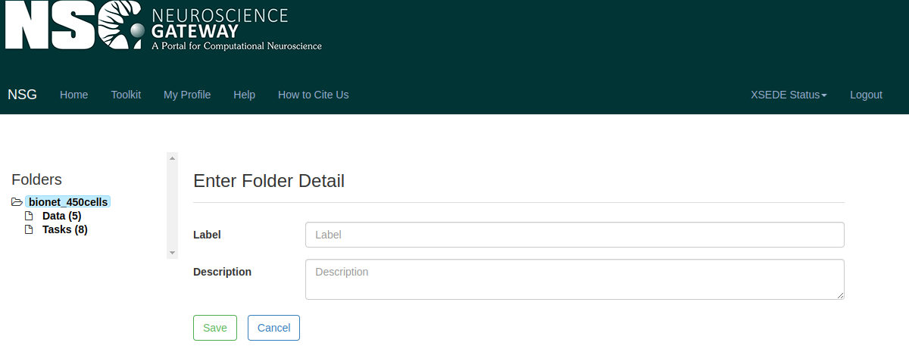
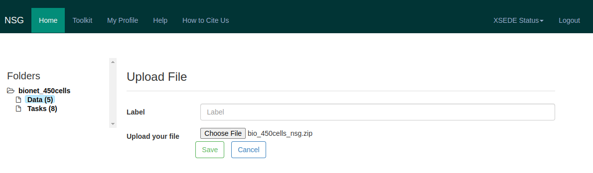
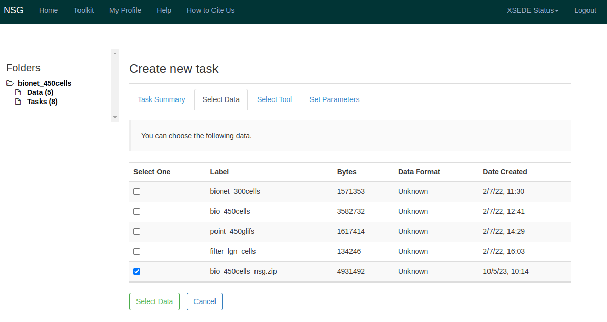
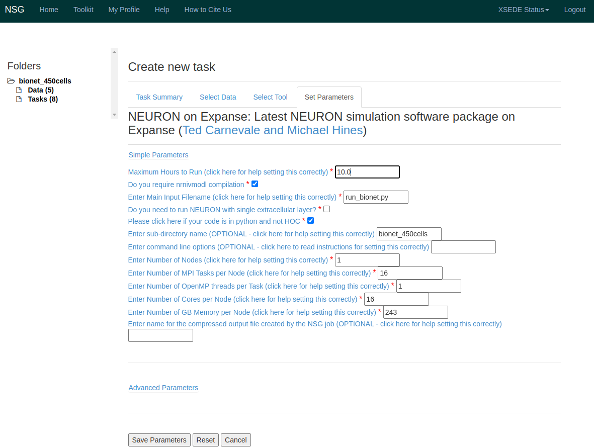

# Running BioNet Simulations on Neuroscience Gate (NSG)

[The Neurscience Gateways](https://www.nsgportal.org/), a part of XSEDE, provides HPC resources for academics and
researchers preforming computational neuroscience work. It includes access to BMTK for building and simulating large-scale network models. Included
are examples and a (non-exhaustive) walkthrough of how to run BioNet simulations using BMTK.

In particular we show how to use the [NSG Web Portal](https://nsgprod.sdsc.edu:8443/portal2/login!input.action).


## 1: Packaging your model and data.

First step is to create a .zip or .tar of the model you are trying to simulate. This should include the SONATA network files, configuration json,
BMTK python scripts, and any other required files like dynamic_params, NEURON mod files, etc - all within the same directory. We've included a number 
of example packages (ex. bio_450cells.zip) as well as an empty template folder for you to add your own files and modify the config.json as required for 
your specific simulation. When you are ready you can use your prefered way of zipping/tar'ing the folder into a package. For instance on Linux/Mac you
can use the command:

```bash
  $ zip bio_450cells.zip -r bio_450cells/
```

Some **caveats** to take note of to get working properly on the NSG Portal (there may be other way to get around this through the Portal):
 1. The files must be zipped up into a sub-directory (eg ./bio_450cells/), NSG Portal may not be able to find the python run-script if the simulation
 directory is zipped into root.
 2. If there are any NEURON mod files that need to be compiled before simulation, then they must be in the core directory as NSG won't be able to find
 them in the components/mechanisms/ directory.


## 2: Running BMTK on NSG Portal

First step is to create an account and log into the NSG Web Portal; once you have do the following to upload and run your model

#### Step 1: Create a new Folder

From the "Home" click **Create New Folder** button to store you Data and Tasks. You can call it whatever is appropiate.



#### Step 2: Upload Data

Once the Folder has been created, click on it and go to the "Data" and choose **Upload Data** and choose the .zip or .tar that you created above.



#### Step 3: Set-up the Task

Now from the created folder go to "Tasks" and select **Create New Task**

* Give it an appropiate Description.
* Click **Select Input Data** and choose the zip/tar file you uploaded in the previous section.


* Click **Select Tool** and choose `NEURON on Expanse` (`Python on Expanse` will also work by may need different command line options).
* Now go to **Set Parameters** and select the following options
    * Under `Enter Main Input Filename` make sure to indicate the name of the main bmtk python script (ex. `run_bionet.py`)
    * Under `Enter sub-directory name` make to sure include the directory name (ex. `bionet_450cells/`)
    * Make sure `Do you require nrnivmodl compilation` and `Please click here if your code is in python and not HOC` are selected.
    * Other options like max hours, number of nodes, tasks and cores, and the GB per node usage will vary on the size of your model.



* Make sure to **Save Parameters**

#### Step 4: Running the Task

Once you have set up your task you can select **Save and Run Task**. This will take you to the "Tasks" page where you can monitor your simulation.
While it is pending/running you can **View Status** of the simulation.


#### Step 5: Fetching the Results

When your simulation is complete, and didn't produce an error, the "Tasks" page will give you the option the **View Output**. Download the `outputfile` 
which will be a .tar.gz file. Inside it you will find a copy of your data folder that should now include an *output/* directory (or whatever path you
choose in the config.json). If everything passed correctly it should include spikes and any other recordings made during the simulation.
